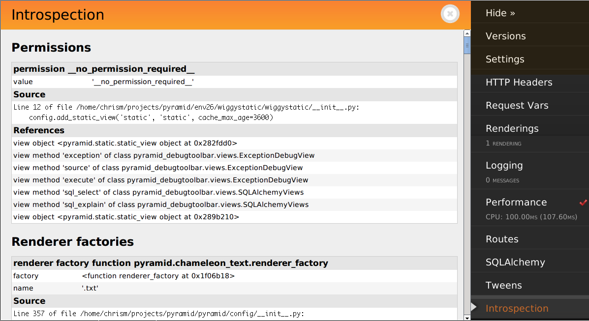

.. index::
   single: introspection
   single: introspector

.. _using_introspection:

Pyramid Configuration Introspection
===================================

When Pyramid starts up, each call to a :term:`configuration directive` causes
one or more :term:`introspectable` objects to be registered with an
:term:`introspector`.  The introspector can be queried by application code to
obtain information about the configuration of the running application.  This
feature is useful for debug toolbars, command-line scripts which show some
aspect of configuration, and for runtime reporting of startup-time
configuration settings.

.. warning::

   Introspection is new in Pyramid 1.3.

Using the Introspector
----------------------

Here's an example of using Pyramid's introspector from within a view
callable:

.. code-block:: python
   :linenos:

    from pyramid.view import view_config
    from pyramid.response import Response

    @view_config(route_name='bar')
    def route_accepts(request):
        introspector = request.registry.introspector
        route_name = request.matched_route.name
        route_intr = introspector.get('routes', route_name)
        return Response(str(route_intr['pattern']))

This view will return a response that contains the "pattern" argument
provided to the ``add_route`` method of the route which matched when the view
was called.  It uses the :meth:`pyramid.interfaces.IIntrospector.get` method
to return an introspectable in the category ``routes`` with a
:term:`discriminator` equal to the matched route name.  It then uses the
returned introspectable to obtain a "pattern" value.

The introspectable returned by the query methods of the introspector has
methods and attributes described by
:class:`pyramid.interfaces.IIntrospectable`.  In particular, the
:meth:`~pyramid.interfaces.IIntrospector.get`,
:meth:`~pyramid.interfaces.IIntrospector.get_category`,
:meth:`~pyramid.interfaces.IIntrospector.categories`,
:meth:`~pyramid.interfaces.IIntrospector.categorized`, and
:meth:`~pyramid.interfaces.IIntrospector.related` methods of an introspector
can be used to query for introspectables.

Introspectable Objects
----------------------

Introspectable objects are returned from query methods of an introspector.
Each introspectable object implements the attributes and methods
documented at :class:`pyramid.interfaces.IIntrospectable`.

The important attributes shared by all introspectables are the following:

``title``

  A human-readable text title describing the introspectable

``category_name``

  A text category name describing the introspection category to which this
  introspectable belongs.  It is often a plural if there are expected to be
  more than one introspectable registered within the category.

``discriminator``

  A hashable object representing the unique value of this introspectable
  within its category.

``discriminator_hash``

  The integer hash of the discriminator (useful for using in HTML links).

``type_name``

  The text name of a subtype within this introspectable's category.  If there
  is only one type name in this introspectable's category, this value will
  often be a singular version of the category name but it can be an arbitrary
  value.

``action_info``

  An object describing the directive call site which caused this
  introspectable to be registered; contains attributes described in
  :class:`pyramid.interfaces.IActionInfo`.

Besides having the attributes described above, an introspectable is a
dictionary-like object.  An introspectable can be queried for data values via
its ``__getitem__``, ``get``, ``keys``, ``values``, or ``items`` methods.
For example:

.. code-block:: python
   :linenos:

    route_intr = introspector.get('routes', 'edit_user')
    pattern = route_intr['pattern']

Pyramid Introspection Categories
--------------------------------

The list of concrete introspection categories provided by built-in Pyramid
configuration directives follows.  Add-on packages may supply other
introspectables in categories not described here.

``subscribers``

  Each introspectable in the ``subscribers`` category represents a call to
  :meth:`pyramid.config.Configurator.add_subscriber` (or the decorator
  equivalent); each will have the following data.

  ``subscriber``

    The subscriber callable object (the resolution of the ``subscriber``
    argument passed to ``add_susbcriber``).

  ``interfaces``

    A sequence of interfaces (or classes) that are subscribed to (the
    resolution of the ``ifaces`` argument passed to ``add_subscriber``).

``response adapters``

  Each introspectable in the ``response adapters`` category represents a call
  to :meth:`pyramid.config.Configurator.add_response_adapter` (or a decorator
  equivalent); each will have the following data.

  ``adapter``

    The adapter object (the resolved ``adapter`` argument to
    ``add_response_adapter``).

  ``type``

    The resolved ``type_or_iface`` argument passed to
    ``add_response_adapter``.

``root factories``

  Each introspectable in the ``root factories`` category represents a call to
  :meth:`pyramid.config.Configurator.set_root_factory` (or the Configurator
  constructor equivalent) *or* a ``factory`` argument passed to
  :meth:`pyramid.config.Configurator.add_route`; each will have the following
  data.

  ``factory``

    The factory object (the resolved ``factory`` argument to
    ``set_root_factory``).

  ``route_name``

    The name of the route which will use this factory.  If this is the
    *default* root factory (if it's registered during a call to
    ``set_root_factory``), this value will be ``None``.

``session factory``

  Only one introspectable will exist in the ``session factory`` category.  It
  represents a call to :meth:`pyramid.config.Configurator.set_session_factory`
  (or the Configurator constructor equivalent); it will have the following
  data.

  ``factory``

    The factory object (the resolved ``factory`` argument to
    ``set_session_factory``).

``request factory``

  Only one introspectable will exist in the ``request factory`` category.  It
  represents a call to :meth:`pyramid.config.Configurator.set_request_factory`
  (or the Configurator constructor equivalent); it will have the following
  data.

  ``factory``

    The factory object (the resolved ``factory`` argument to
    ``set_request_factory``).

``locale negotiator``

  Only one introspectable will exist in the ``locale negotiator`` category.
  It represents a call to
  :meth:`pyramid.config.Configurator.set_locale_negotiator` (or the
  Configurator constructor equivalent); it will have the following data.

  ``negotiator``

    The factory object (the resolved ``negotiator`` argument to
    ``set_locale_negotiator``).

``renderer factories``

  Each introspectable in the ``renderer factories`` category represents a
  call to :meth:`pyramid.config.Configurator.add_renderer` (or the
  Configurator constructor equivalent); each will have the following data.

  ``name``

    The name of the renderer (the value of the ``name`` argument to
    ``add_renderer``).

  ``factory``

    The factory object (the resolved ``factory`` argument to
    ``add_renderer``).

``renderer globals factory``

  There will be one and only one introspectable in the ``renderer globals
  factory`` category.  It represents a call to
  :meth:`pyramid.config.Configurator.set_renderer_globals_factory`; it will
  have the following data.

  ``factory``

    The factory object (the resolved ``factory`` argument to
    ``set_renderer_globals_factory``).

``routes``

  Each introspectable in the ``routes`` category represents a call to
  :meth:`pyramid.config.Configurator.add_route`; each will have the following
  data.

  ``name``

    The ``name`` argument passed to ``add_route``.

  ``pattern``

    The ``pattern`` argument passed to ``add_route``.

  ``factory``

    The (resolved) ``factory`` argument passed to ``add_route``.

  ``xhr``

    The ``xhr`` argument passed to ``add_route``.

  ``request_method``

    The ``request_method`` argument passed to ``add_route``.

  ``request_methods``

    A sequence of request method names implied by the ``request_method``
    argument passed to ``add_route`` or the value ``None`` if a
    ``request_method`` argument was not supplied.

  ``path_info``

    The ``path_info`` argument passed to ``add_route``.

  ``request_param``

    The ``request_param`` argument passed to ``add_route``.

  ``header``

    The ``header`` argument passed to ``add_route``.

  ``accept``

    The ``accept`` argument passed to ``add_route``.

  ``traverse``

    The ``traverse`` argument passed to ``add_route``.

  ``custom_predicates``

    The ``custom_predicates`` argument passed to ``add_route``.

  ``pregenerator``

    The ``pregenerator`` argument passed to ``add_route``.

  ``static``

    The ``static`` argument passed to ``add_route``.

  ``use_global_views``

    The ``use_global_views`` argument passed to ``add_route``.

  ``object``

     The :class:`pyramid.interfaces.IRoute` object that is used to perform
     matching and generation for this route.

``authentication policy``

  There will be one and only one introspectable in the ``authentication
  policy`` category.  It represents a call to the
  :meth:`pyramid.config.Configurator.set_authentication_policy` method (or
  its Configurator constructor equivalent); it will have the following data.

  ``policy``

    The policy object (the resolved ``policy`` argument to
    ``set_authentication_policy``).

``authorization policy``

  There will be one and only one introspectable in the ``authorization
  policy`` category.  It represents a call to the
  :meth:`pyramid.config.Configurator.set_authorization_policy` method (or its
  Configurator constructor equivalent); it will have the following data.

  ``policy``

    The policy object (the resolved ``policy`` argument to
    ``set_authorization_policy``).

``default permission``

  There will be one and only one introspectable in the ``default permission``
  category.  It represents a call to the
  :meth:`pyramid.config.Configurator.set_default_permission` method (or its
  Configurator constructor equivalent); it will have the following data.

  ``value``

    The permission name passed to ``set_default_permission``.

``views``

  Each introspectable in the ``views`` category represents a call to
  :meth:`pyramid.config.Configurator.add_view`; each will have the following
  data.

  ``name``

    The ``name`` argument passed to ``add_view``.

  ``context``

    The (resolved) ``context`` argument passed to ``add_view``.

  ``containment``

    The (resolved) ``containment`` argument passed to ``add_view``.

  ``request_param``

    The ``request_param`` argument passed to ``add_view``.

  ``request_methods``

    A sequence of request method names implied by the ``request_method``
    argument passed to ``add_view`` or the value ``None`` if a
    ``request_method`` argument was not supplied.

  ``route_name``

    The ``route_name`` argument passed to ``add_view``.

  ``attr``

    The ``attr`` argument passed to ``add_view``.

  ``xhr``

    The ``xhr`` argument passed to ``add_view``.

  ``accept``

    The ``accept`` argument passed to ``add_view``.

  ``header``

    The ``header`` argument passed to ``add_view``.

  ``path_info``

    The ``path_info`` argument passed to ``add_view``.

  ``match_param``

    The ``match_param`` argument passed to ``add_view``.

  ``callable``

    The (resolved) ``view`` argument passed to ``add_view``.  Represents the
    "raw" view callable.

  ``derived_callable``

    The view callable derived from the ``view`` argument passed to
    ``add_view``.  Represents the view callable which Pyramid itself calls
    (wrapped in security and other wrappers).

  ``mapper``

    The (resolved) ``mapper`` argument passed to ``add_view``.

  ``decorator``

    The (resolved) ``decorator`` argument passed to ``add_view``.

``permissions``

  Each introspectable in the ``permissions`` category represents a call to
  :meth:`pyramid.config.Configurator.add_view` that has an explicit
  ``permission`` argument to *or* a call to
  :meth:`pyramid.config.Configurator.set_default_permission`; each will have
  the following data.

  ``value``

    The permission name passed to ``add_view`` or ``set_default_permission``.

``templates``

  Each introspectable in the ``templates`` category represents a call to
  :meth:`pyramid.config.Configurator.add_view` that has a ``renderer``
  argument which points to a template; each will have the following data.

  ``name``

    The renderer's name (a string).

  ``type``

    The renderer's type (a string).

  ``renderer``

    The :class:`pyramid.interfaces.IRendererInfo` object which represents
    this template's renderer.

``view mapper``

  Each introspectable in the ``permissions`` category represents a call to
  :meth:`pyramid.config.Configurator.add_view` that has an explicit
  ``mapper`` argument to *or* a call to
  :meth:`pyramid.config.Configurator.set_view_mapper`; each will have
  the following data.

  ``mapper``

    The (resolved) ``mapper`` argument passed to ``add_view`` or
    ``set_view_mapper``.

``asset overrides``

  Each introspectable in the ``asset overrides`` category represents a call
  to :meth:`pyramid.config.Configurator.override_asset`; each will have the
  following data.

  ``to_override``

    The ``to_override`` argument (an asset spec) passed to
    ``override_asset``.

  ``override_with``

    The ``override_with`` argument (an asset spec) passed to
    ``override_asset``.

``translation directories``

  Each introspectable in the ``asset overrides`` category represents an
  individual element in a ``specs`` argument passed to to
  :meth:`pyramid.config.Configurator.add_translation_dirs`; each will have
  the following data.

  ``directory``

    The absolute path of the translation directory.

  ``spec``

    The asset specification passed to ``add_translation_dirs``.

``tweens``

  Each introspectable in the ``tweens`` category represents a call to
  :meth:`pyramid.config.Configurator.add_tween`; each will have the following
  data.

  ``name``

    The dotted name to the tween factory as a string (passed as
    the ``tween_factory`` argument to ``add_tween``).

  ``factory``

    The (resolved) tween factory object.

  ``type``

    ``implict`` or ``explicit`` as a string.

  ``under``

     The ``under`` argument passed to ``add_tween`` (a string).

  ``over``

     The ``over`` argument passed to ``add_tween`` (a string).

``static views``

  Each introspectable in the ``static views`` category represents a call to
  :meth:`pyramid.config.Configurator.add_static_view`; each will have the
  following data.

  ``name``

    The ``name`` argument provided to ``add_static_view``.

  ``spec``

    A normalized version of the ``spec`` argument provided to
    ``add_static_view``.

Introspection in the Toolbar
----------------------------

The Pyramid debug toolbar (part of the ``pyramid_debugtoolbar`` package)
provides a canned view of all registered introspectables and their
relationships.  It looks something like this:

Disabling Introspection
-----------------------

You can disable Pyramid introspection by passing the object
:attr:`pyramid.registry.noop_introspector` to the :term:`Configurator`
constructor in your application setup:

.. code-block:: python

   from pyramid.config import Configurator
   from pyramid.registry import noop_introspector
   config = Configurator(..., introspector=noop_introspector)

When the noop introspector is active, all introspectables generated by
configuration directives are thrown away.  A noop introspector behaves just
like a "real" introspector, but the methods of a noop introspector do nothing
and return null values.
