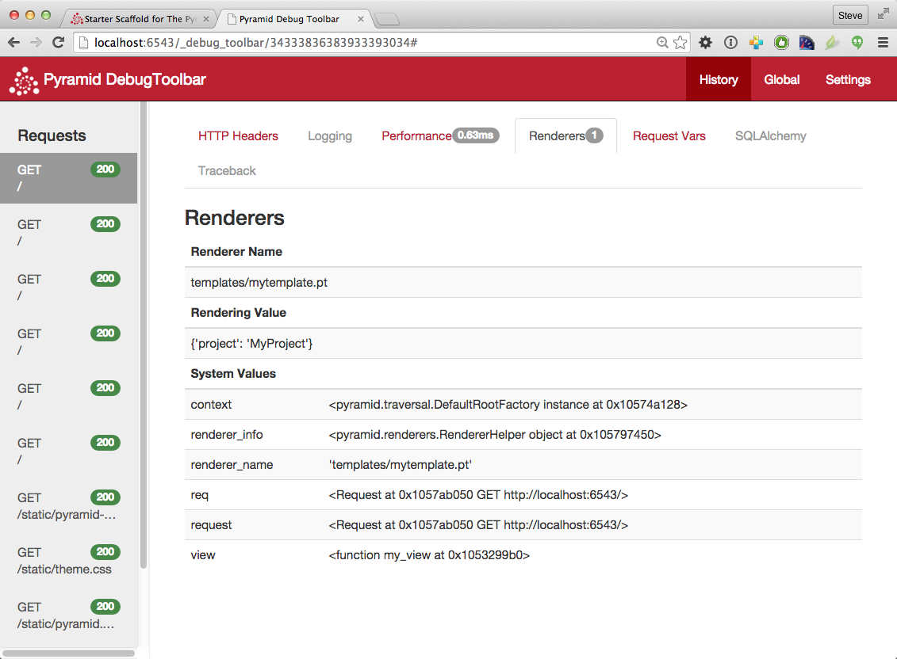

.. _project_narr:

Creating a :app:`Pyramid` Project
====================================

As we saw in :ref:`firstapp_chapter`, it's possible to create a
:app:`Pyramid` application completely manually.  However, it's usually more
convenient to use a :term:`scaffold` to generate a basic :app:`Pyramid`
:term:`project`.

A project is a directory that contains at least one Python :term:`package`.
You'll use a scaffold to create a project, and you'll create your application
logic within a package that lives inside the project.  Even if your
application is extremely simple, it is useful to place code that drives the
application within a package, because: 1) a package is more easily extended
with new code and 2) an application that lives inside a package can also be
distributed more easily than one which does not live within a package.

:app:`Pyramid` comes with a variety of scaffolds that you can use to generate
a project.  Each scaffold makes different configuration assumptions about
what type of application you're trying to construct.

These scaffolds are rendered using the ``pcreate`` command that is installed
as part of Pyramid.

.. index::
   single: scaffolds
   single: starter scaffold
   single: zodb scaffold
   single: alchemy scaffold

.. _additional_paster_scaffolds:

Scaffolds Included with :app:`Pyramid`
------------------------------------------------

The convenience scaffolds included with :app:`Pyramid` differ from
each other on a number of axes:

- the persistence mechanism they offer (no persistence mechanism,
  :term:`ZODB`, or :term:`SQLAlchemy`).

- the mechanism they use to map URLs to code (:term:`traversal` or :term:`URL
  dispatch`).

The included scaffolds are these:

``starter``
  URL mapping via :term:`URL dispatch` and no persistence mechanism.

``zodb``
  URL mapping via :term:`traversal` and persistence via :term:`ZODB`.  *Note
  that, as of this writing, this scaffold will not run under Python 3, only
  under Python 2.*

``alchemy``
  URL mapping via :term:`URL dispatch` and persistence via
  :term:`SQLAlchemy`

.. index::
   single: creating a project
   single: project

.. _creating_a_project:

Creating the Project
--------------------

In :ref:`installing_chapter`, you created a virtual Python environment via
the ``virtualenv`` command.  To start a :app:`Pyramid` :term:`project`, use
the ``pcreate`` command installed within the virtualenv.  In
:ref:`installing_chapter` we called the virtualenv directory ``env``; the
following command assumes that our current working directory is that
directory.  We'll choose the ``starter`` scaffold for this purpose.

On UNIX:

.. code-block:: text

   $ bin/pcreate -s starter MyProject

Or on Windows:

.. code-block:: text

   $ Scripts\pcreate -s starter MyProject

The above command uses the ``pcreate`` command to create a project with the
``starter`` scaffold.  To use a different scaffold, such as
``alchemy``, you'd just change the ``-s`` argument value.  For example,
on UNIX:

.. code-block:: text

   $ bin/pcreate -s alchemy MyProject

Or on Windows:

.. code-block:: text

   $ Scripts\pcreate alchemy MyProject

Here's sample output from a run of ``pcreate`` on UNIX for a project we name
``MyProject``:

.. code-block:: text

   $ bin/pcreate -s starter MyProject
   Creating template pyramid
   Creating directory ./MyProject
   # ... more output ...
   Running /Users/chrism/projects/pyramid/bin/python setup.py egg_info

As a result of invoking the ``pcreate`` command, a project is created in a
directory named ``MyProject``.  That directory is a :term:`project`
directory.  The ``setup.py`` file in that directory can be used to distribute
your application, or install your application for deployment or development.

A ``.ini`` file named ``development.ini`` will be created in the project
directory.  You will use this ``.ini`` file to configure a server, to run
your application, and to debug your application.  It contains configuration
that enables an interactive debugger and settings optimized for development.

Another ``.ini`` file named ``production.ini`` will also be created in the
project directory.  It contains configuration that disables any interactive
debugger (to prevent inappropriate access and disclosure), and turns off a
number of debugging settings.  You can use this file to put your application
into production.

The ``MyProject`` project directory contains an additional subdirectory named
``myproject`` (note the case difference) representing a Python
:term:`package` which holds very simple :app:`Pyramid` sample code.  This is
where you'll edit your application's Python code and templates.

.. index::
   single: setup.py develop
   single: development install

Installing your Newly Created Project for Development
-----------------------------------------------------

To install a newly created project for development, you should ``cd`` to the
newly created project directory and use the Python interpreter from the
:term:`virtualenv` you created during :ref:`installing_chapter` to invoke the
command ``python setup.py develop``

The file named ``setup.py`` will be in the root of the pcreate-generated
project directory.  The ``python`` you're invoking should be the one that
lives in the ``bin`` (or ``Scripts`` on Windows) directory of your virtual
Python environment.  Your terminal's current working directory *must* be the
newly created project directory.

On UNIX:

.. code-block:: text

   $ cd MyProject
   $ ../bin/python setup.py develop

Or on Windows:

.. code-block:: text

   $ cd MyProject
   $ ..\Scripts\python.exe setup.py develop

Elided output from a run of this command on UNIX is shown below:

.. code-block:: text

   $ cd MyProject
   $ ../bin/python setup.py develop
   ...
   Finished processing dependencies for MyProject==0.0

This will install a :term:`distribution` representing your project into the
interpreter's library set so it can be found by ``import`` statements and by
other console scripts such as ``pserve``, ``pshell``, ``proutes`` and
``pviews``.

.. index::
   single: running tests
   single: tests (running)

Running The Tests For Your Application
--------------------------------------

To run unit tests for your application, you should invoke them using the
Python interpreter from the :term:`virtualenv` you created during
:ref:`installing_chapter` (the ``python`` command that lives in the ``bin``
directory of your virtualenv).

On UNIX:

.. code-block:: text

   $ ../bin/python setup.py test -q

Or on Windows:

.. code-block:: text

   $ ..\Scripts\python.exe setup.py test -q

Here's sample output from a test run on UNIX:

.. code-block:: text

   $ ../bin/python setup.py test -q
   running test
   running egg_info
   writing requirements to MyProject.egg-info/requires.txt
   writing MyProject.egg-info/PKG-INFO
   writing top-level names to MyProject.egg-info/top_level.txt
   writing dependency_links to MyProject.egg-info/dependency_links.txt
   writing entry points to MyProject.egg-info/entry_points.txt
   reading manifest file 'MyProject.egg-info/SOURCES.txt'
   writing manifest file 'MyProject.egg-info/SOURCES.txt'
   running build_ext
   ..
   ----------------------------------------------------------------------
   Ran 1 test in 0.108s

   OK

.. note::

   The ``-q`` option is passed to the ``setup.py test`` command to limit the
   output to a stream of dots.  If you don't pass ``-q``, you'll see more
   verbose test result output (which normally isn't very useful).

The tests themselves are found in the ``tests.py`` module in your ``pcreate``
generated project.  Within a project generated by the ``starter`` scaffold, a
single sample test exists.

.. index::
   single: running an application
   single: pserve
   single: reload
   single: startup

Running The Project Application
-------------------------------

Once a project is installed for development, you can run the application it
represents using the ``pserve`` command against the generated configuration
file.  In our case, this file is named ``development.ini``.

On UNIX:

.. code-block:: text

   $ ../bin/pserve development.ini

On Windows:

.. code-block:: text

   $ ..\Scripts\pserve development.ini

Here's sample output from a run of ``pserve`` on UNIX:

.. code-block:: text

   $ ../bin/pserve development.ini
   Starting server in PID 16601.
   serving on 0.0.0.0:6543 view at http://127.0.0.1:6543

By default, :app:`Pyramid` applications generated from a scaffold
will listen on TCP port 6543.  You can shut down a server started this way by
pressing ``Ctrl-C``.

During development, it's often useful to run ``pserve`` using its
``--reload`` option.  When ``--reload`` is passed to ``pserve``, changes to
any Python module your project uses will cause the server to restart.  This
typically makes development easier, as changes to Python code made within a
:app:`Pyramid` application is not put into effect until the server restarts.

For example, on UNIX:

.. code-block:: text

   $ ../bin/pserve development.ini --reload
   Starting subprocess with file monitor
   Starting server in PID 16601.
   Starting HTTP server on http://0.0.0.0:6543

For more detailed information about the startup process, see
:ref:`startup_chapter`.  For more information about environment variables and
configuration file settings that influence startup and runtime behavior, see
:ref:`environment_chapter`.

.. index::
   single: WSGI

Viewing the Application
-----------------------

Once your application is running via ``pserve``, you may visit
``http://localhost:6543/`` in your browser.  You will see something in your
browser like what is displayed in the following image:

.. image:: project.png

This is the page shown by default when you visit an unmodified ``pcreate``
generated ``starter`` application in a browser.

.. index::
   single: debug toolbar

.. _debug_toolbar:

The Debug Toolbar
~~~~~~~~~~~~~~~~~

If you click on the image shown at the right hand top of the page ("^DT"),
you'll be presented with a debug toolbar that provides various niceties while
you're developing.  This image will float above every HTML page served by
:app:`Pyramid` while you develop an application, and allows you show the
toolbar as necessary.  Click on ``Hide`` to hide the toolbar and show the
image again.

For more information about what the debug toolbar allows you to do, see `the
documentation for pyramid_debugtoolbar
<http://docs.pylonsproject.org/projects/pyramid_debugtoolbar/dev/>`_.

The debug toolbar will not be shown (and all debugging will be turned off)
when you use the ``production.ini`` file instead of the ``development.ini``
ini file to run the application.

You can also turn the debug toolbar off by editing ``development.ini`` and
commenting out the line ``pyramid.includes = pyramid_debugtoolbar``.  For
example, instead of:

.. code-block:: ini
   :linenos:

   [app:main]
   ...
   pyramid.includes = pyramid_debugtoolbar

Put a hash mark in front of the ``pyramid.includes`` line:

.. code-block:: ini
   :linenos:

   [app:main]
   ...
   #pyramid.includes = pyramid_debugtoolbar

Then restart the application to see that the toolbar has been turned off.

.. index::
   single: project structure

The Project Structure
---------------------

The ``starter`` scaffold generated a :term:`project` (named ``MyProject``),
which contains a Python :term:`package`.  The package is *also* named
``myproject``, but it's lowercased; the scaffold generates a project which
contains a package that shares its name except for case.

All :app:`Pyramid` ``pcreate`` -generated projects share a similar structure.
The ``MyProject`` project we've generated has the following directory
structure:

.. code-block:: text

  MyProject/
  |-- CHANGES.txt
  |-- development.ini
  |-- MANIFEST.in
  |-- myproject
  |   |-- __init__.py
  |   |-- static
  |   |   |-- favicon.ico
  |   |   |-- logo.png
  |   |   `-- pylons.css
  |   |-- templates
  |   |   `-- mytemplate.pt
  |   |-- tests.py
  |   `-- views.py
  |-- production.ini
  |-- README.txt
  |-- setup.cfg
  `-- setup.py

The ``MyProject`` :term:`Project`
---------------------------------

The ``MyProject`` :term:`project` directory is the distribution and
deployment wrapper for your application.  It contains both the ``myproject``
:term:`package` representing your application as well as files used to
describe, run, and test your application.

#. ``CHANGES.txt`` describes the changes you've made to the application.  It
   is conventionally written in :term:`ReStructuredText` format.

#. ``README.txt`` describes the application in general.  It is conventionally
   written in :term:`ReStructuredText` format.

#. ``development.ini`` is a :term:`PasteDeploy` configuration file that can
   be used to execute your application during development.

#. ``production.ini`` is a :term:`PasteDeploy` configuration file that can
   be used to execute your application in a production configuration.

#. ``setup.cfg`` is a :term:`setuptools` configuration file used by
   ``setup.py``.

#. ``MANIFEST.in`` is a :term:`distutils` "manifest" file, naming which files
   should be included in a source distribution of the package when ``python
   setup.py sdist`` is run.

#. ``setup.py`` is the file you'll use to test and distribute your
   application.  It is a standard :term:`setuptools` ``setup.py`` file.

.. index::
   single: PasteDeploy
   single: ini file

.. _MyProject_ini:

``development.ini``
~~~~~~~~~~~~~~~~~~~

The ``development.ini`` file is a :term:`PasteDeploy` configuration file.
Its purpose is to specify an application to run when you invoke ``pserve``,
as well as the deployment settings provided to that application.

The generated ``development.ini`` file looks like so:

.. literalinclude:: MyProject/development.ini
   :language: ini
   :linenos:

This file contains several sections including ``[app:main]``,
``[server:main]`` and several other sections related to logging
configuration.

The ``[app:main]`` section represents configuration for your :app:`Pyramid`
application.  The ``use`` setting is the only setting required to be present
in the ``[app:main]`` section.  Its default value, ``egg:MyProject``,
indicates that our MyProject project contains the application that should be
served.  Other settings added to this section are passed as keyword arguments
to the function named ``main`` in our package's ``__init__.py`` module.  You
can provide startup-time configuration parameters to your application by
adding more settings to this section.

.. note:: See :ref:`pastedeploy_entry_points` for more information about the
   meaning of the ``use = egg:MyProject`` value in this section.

The ``pyramid.reload_templates`` setting in the ``[app:main]`` section is a
:app:`Pyramid` -specific setting which is passed into the framework.  If it
exists, and its value is ``true``, :term:`Chameleon` and :term:`Mako`
template changes will not require an application restart to be detected.  See
:ref:`reload_templates_section` for more information.

The ``pyramid.debug_templates`` setting in the ``[app:main]`` section is a
:app:`Pyramid` -specific setting which is passed into the framework.  If it
exists, and its value is ``true``, :term:`Chameleon` template exceptions will
contain more detailed and helpful information about the error than when this
value is ``false``.  See :ref:`debug_templates_section` for more information.

.. warning:: The ``pyramid.reload_templates`` and ``pyramid.debug_templates``
   options should be turned off for production applications, as template
   rendering is slowed when either is turned on.

The ``pyramid.includes`` setting in the ``[app:main]`` section tells Pyramid
to "include" configuration from another package.  In this case, the line
``pyramid.includes = pyramid_debugtoolbar`` tells Pyramid to include
configuration from the ``pyramid_debugtoolbar`` package.  This turns on a
debugging panel in development mode which will be shown on the right hand
side of the screen.  Including the debug toolbar will also make it possible
to interactively debug exceptions when an error occurs.

Various other settings may exist in this section having to do with debugging
or influencing runtime behavior of a :app:`Pyramid` application.  See
:ref:`environment_chapter` for more information about these settings.

The name ``main`` in ``[app:main]`` signifies that this is the default
application run by ``pserve`` when it is invoked against this configuration
file.  The name ``main`` is a convention used by PasteDeploy signifying that
it is the default application.

The ``[server:main]`` section of the configuration file configures a WSGI
server which listens on TCP port 6543.  It is configured to listen on all
interfaces (``0.0.0.0``).  This means that any remote system which has TCP
access to your system can see your Pyramid application.

The sections that live between the markers ``# Begin logging configuration``
and ``# End logging configuration`` represent Python's standard library
:mod:`logging` module configuration for your application.  The sections
between these two markers are passed to the `logging module's config file
configuration engine
<http://docs.python.org/howto/logging.html#configuring-logging>`_ when the
``pserve`` or ``pshell`` commands are executed.  The default
configuration sends application logging output to the standard error output
of your terminal.  For more information about logging configuration, see
:ref:`logging_chapter`.

See the :term:`PasteDeploy` documentation for more information about other
types of things you can put into this ``.ini`` file, such as other
applications, :term:`middleware` and alternate :term:`WSGI` server
implementations.

.. index::
   single: production.ini

``production.ini``
~~~~~~~~~~~~~~~~~~~

The ``production.ini`` file is a :term:`PasteDeploy` configuration file with
a purpose much like that of ``development.ini``.  However, it disables the
debug toolbar, and filters all log messages except those above the WARN
level.  It also turns off template development options such that templates
are not automatically reloaded when changed, and turns off all debugging
options.  This file is appropriate to use instead of ``development.ini`` when
you put your application into production.

It's important to use ``production.ini`` (and *not* ``development.ini``) to
benchmark your application and put it into production.  ``development.ini``
configures your system with a debug toolbar that helps development, but the
inclusion of this toolbar slows down page rendering times by over an order of
magnitude.  The debug toolbar is also a potential security risk if you have
it configured incorrectly.

.. index::
   single: MANIFEST.in

``MANIFEST.in``
~~~~~~~~~~~~~~~

The ``MANIFEST.in`` file is a :term:`distutils` configuration file which
specifies the non-Python files that should be included when a
:term:`distribution` of your Pyramid project is created when you run ``python
setup.py sdist``.  Due to the information contained in the default
``MANIFEST.in``, an sdist of your Pyramid project will include ``.txt``
files, ``.ini`` files, ``.rst`` files, graphics files, and template files, as
well as ``.py`` files.  See
http://docs.python.org/distutils/sourcedist.html#the-manifest-in-template for
more information about the syntax and usage of ``MANIFEST.in``.

Without the presence of a ``MANIFEST.in`` file or without checking your
source code into a version control repository, ``setup.py sdist`` places only
*Python source files* (files ending with a ``.py`` extension) into tarballs
generated by ``python setup.py sdist``.  This means, for example, if your
project was not checked into a setuptools-compatible source control system,
and your project directory didn't contain a ``MANIFEST.in`` file that told
the ``sdist`` machinery to include ``*.pt`` files, the
``myproject/templates/mytemplate.pt`` file would not be included in the
generated tarball.

Projects generated by Pyramid scaffolds include a default ``MANIFEST.in``
file.  The ``MANIFEST.in`` file contains declarations which tell it to
include files like ``*.pt``, ``*.css`` and ``*.js`` in the generated tarball.
If you include files with extensions other than the files named in the
project's ``MANIFEST.in`` and you don't make use of a setuptools-compatible
version control system, you'll need to edit the ``MANIFEST.in`` file and
include the statements necessary to include your new files.  See
http://docs.python.org/distutils/sourcedist.html#principle for more
information about how to do this.

You can also delete ``MANIFEST.in`` from your project and rely on a
setuptools feature which simply causes all files checked into a version
control system to be put into the generated tarball.  To allow this to
happen, check all the files that you'd like to be distributed along with your
application's Python files into Subversion.  After you do this, when you
rerun ``setup.py sdist``, all files checked into the version control system
will be included in the tarball.  If you don't use Subversion, and instead
use a different version control system, you may need to install a setuptools
add-on such as ``setuptools-git`` or ``setuptools-hg`` for this behavior to
work properly.

.. index::
   single: setup.py

``setup.py``
~~~~~~~~~~~~

The ``setup.py`` file is a :term:`setuptools` setup file.  It is meant to be
run directly from the command line to perform a variety of functions, such as
testing your application, packaging, and distributing your application.

.. note::

  ``setup.py`` is the defacto standard which Python developers use to
  distribute their reusable code.  You can read more about ``setup.py`` files
  and their usage in the `Setuptools documentation
  <http://peak.telecommunity.com/DevCenter/setuptools>`_ and `The
  Hitchhiker's Guide to Packaging <http://guide.python-distribute.org/>`_.

Our generated ``setup.py`` looks like this:

.. literalinclude:: MyProject/setup.py
   :language: python
   :linenos:

The ``setup.py`` file calls the setuptools ``setup`` function, which does
various things depending on the arguments passed to ``setup.py`` on the
command line.

Within the arguments to this function call, information about your
application is kept.  While it's beyond the scope of this documentation to
explain everything about setuptools setup files, we'll provide a whirlwind
tour of what exists in this file in this section.

Your application's name can be any string; it is specified in the ``name``
field.  The version number is specified in the ``version`` value.  A short
description is provided in the ``description`` field.  The
``long_description`` is conventionally the content of the README and CHANGES
file appended together.  The ``classifiers`` field is a list of `Trove
<http://pypi.python.org/pypi?%3Aaction=list_classifiers>`_ classifiers
describing your application.  ``author`` and ``author_email`` are text fields
which probably don't need any description.  ``url`` is a field that should
point at your application project's URL (if any).
``packages=find_packages()`` causes all packages within the project to be
found when packaging the application.  ``include_package_data`` will include
non-Python files when the application is packaged if those files are checked
into version control.  ``zip_safe`` indicates that this package is not safe
to use as a zipped egg; instead it will always unpack as a directory, which
is more convenient.  ``install_requires`` and ``tests_require`` indicate that
this package depends on the ``pyramid`` package.  ``test_suite`` points at
the package for our application, which means all tests found in the package
will be run when ``setup.py test`` is invoked.  We examined ``entry_points``
in our discussion of the ``development.ini`` file; this file defines the
``main`` entry point that represents our project's application.

Usually you only need to think about the contents of the ``setup.py`` file
when distributing your application to other people, when adding Python
package dependencies, or when versioning your application for your own use.
For fun, you can try this command now:

.. code-block:: text

   $ python setup.py sdist

This will create a tarball of your application in a ``dist`` subdirectory
named ``MyProject-0.1.tar.gz``.  You can send this tarball to other people
who want to install and use your application.

.. index::
   single: setup.cfg

``setup.cfg``
~~~~~~~~~~~~~

The ``setup.cfg`` file is a :term:`setuptools` configuration file.  It
contains various settings related to testing and internationalization:

Our generated ``setup.cfg`` looks like this:

.. literalinclude:: MyProject/setup.cfg
   :language: guess
   :linenos:

The values in the default setup file allow various commonly-used
internationalization commands and testing commands to work more smoothly.

.. index::
   single: package

The ``myproject`` :term:`Package`
---------------------------------

The ``myproject`` :term:`package` lives inside the ``MyProject``
:term:`project`.  It contains:

#. An ``__init__.py`` file signifies that this is a Python :term:`package`.
   It also contains code that helps users run the application, including a
   ``main`` function which is used as a entry point for commands such as
   ``pserve``, ``pshell``, ``pviews``, and others.

#. A ``templates`` directory, which contains :term:`Chameleon` (or
   other types of) templates.

#. A ``tests.py`` module, which contains unit test code for the
   application.

#. A ``views.py`` module, which contains view code for the
   application.

These are purely conventions established by the scaffold:
:app:`Pyramid` doesn't insist that you name things in any particular way.
However, it's generally a good idea to follow Pyramid standards for naming,
so that other Pyramid developers can get up to speed quickly on your code
when you need help.

.. index::
   single: __init__.py

.. _init_py:

``__init__.py``
~~~~~~~~~~~~~~~

We need a small Python module that configures our application and which
advertises an entry point for use by our :term:`PasteDeploy` ``.ini`` file.
This is the file named ``__init__.py``.  The presence of an ``__init__.py``
also informs Python that the directory which contains it is a *package*.

.. literalinclude:: MyProject/myproject/__init__.py
   :language: python
   :linenos:

#. Line 1 imports the :term:`Configurator` class from :mod:`pyramid.config`
   that we use later.

#. Lines 3-16 define a function named ``main`` that returns a :app:`Pyramid`
   WSGI application.  This function is meant to be called by the
   :term:`PasteDeploy` framework as a result of running ``pserve``.

   Within this function, application configuration is performed.

   Line 6 creates an instance of a :term:`Configurator`.

   Line 7 registers a static view, which will serve up the files from the
   ``mypackage:static`` :term:`asset specification` (the ``static``
   directory of the ``mypackage`` package).

   Line 8 adds a :term:`route` to the configuration.  This route is later
   used by a view in the ``views`` module.

   Line 9 calls ``config.scan()``, which picks up view registrations declared
   elsewhere in the package (in this case, in the ``views.py`` module).

   Line 10 returns a :term:`WSGI` application to the caller of the function
   (Pyramid's pserve).

.. index::
   single: views.py

``views.py``
~~~~~~~~~~~~

Much of the heavy lifting in a :app:`Pyramid` application is done by *view
callables*.  A :term:`view callable` is the main tool of a :app:`Pyramid` web
application developer; it is a bit of code which accepts a :term:`request`
and which returns a :term:`response`.

.. literalinclude:: MyProject/myproject/views.py
   :language: python
   :linenos:

Lines 3-5 define and register a :term:`view callable` named ``my_view``.  The
function named ``my_view`` is decorated with a ``view_config`` decorator
(which is processed by the ``config.scan()`` line in our ``__init__.py``).
The view_config decorator asserts that this view be found when a
:term:`route` named ``home`` is matched.  In our case, because our
``__init__.py`` maps the route named ``home`` to the URL pattern ``/``, this
route will match when a visitor visits the root URL.  The view_config
decorator also names a ``renderer``, which in this case is a template that
will be used to render the result of the view callable.  This particular view
declaration points at ``templates/mytemplate.pt``, which is a :term:`asset
specification` that specifies the ``mytemplate.pt`` file within the
``templates`` directory of the ``myproject`` package.  The asset
specification could have also been specified as
``myproject:templates/mytemplate.pt``; the leading package name and colon is
optional.  The template file it actually points to is a :term:`Chameleon` ZPT
template file.

This view callable function is handed a single piece of information: the
:term:`request`.  The *request* is an instance of the :term:`WebOb`
``Request`` class representing the browser's request to our server.

This view returns a dictionary.  When this view is invoked, a
:term:`renderer` converts the dictionary returned by the view into HTML, and
returns the result as the :term:`response`.  This view is configured to
invoke a renderer which uses a :term:`Chameleon` ZPT template
(``templates/my_template.pt``).

See :ref:`views_which_use_a_renderer` for more information about how views,
renderers, and templates relate and cooperate.

.. note:: Because our ``development.ini`` has a ``pyramid.reload_templates =
   true`` directive indicating that templates should be reloaded when
   they change, you won't need to restart the application server to
   see changes you make to templates.  During development, this is
   handy.  If this directive had been ``false`` (or if the directive
   did not exist), you would need to restart the application server
   for each template change.  For production applications, you should
   set your project's ``pyramid.reload_templates`` to ``false`` to increase
   the speed at which templates may be rendered.

.. index::
   single: static directory

``static``
~~~~~~~~~~

This directory contains static assets which support the ``mytemplate.pt``
template.  It includes CSS and images.

``templates/mytemplate.pt``
~~~~~~~~~~~~~~~~~~~~~~~~~~~

The single :term:`Chameleon` template that exists in the project.  Its
contents are too long to show here, but it displays a default page when
rendered.  It is referenced by the call to ``@view_config`` as the
``renderer`` of the ``my_view`` view callable in the ``views.py`` file.  See
:ref:`views_which_use_a_renderer` for more information about renderers.

Templates are accessed and used by view configurations and sometimes by view
functions themselves.  See :ref:`templates_used_directly` and
:ref:`templates_used_as_renderers`.

.. index::
   single: tests.py

``tests.py``
~~~~~~~~~~~~

The ``tests.py`` module includes unit tests for your application.

.. literalinclude:: MyProject/myproject/tests.py
   :language: python
   :linenos:

This sample ``tests.py`` file has a single unit test defined within it.  This
test is executed when you run ``python setup.py test``.  You may add more
tests here as you build your application.  You are not required to write
tests to use :app:`Pyramid`, this file is simply provided as convenience and
example.

See :ref:`testing_chapter` for more information about writing :app:`Pyramid`
unit tests.

.. index::
   pair: modifying; package structure

.. _modifying_package_structure:

Modifying Package Structure
----------------------------

It is best practice for your application's code layout to not stray too much
from accepted Pyramid scaffold defaults.  If you refrain from changing
things very much, other Pyramid coders will be able to more quickly
understand your application.  However, the code layout choices made for you
by a scaffold are in no way magical or required.  Despite the choices
made for you by any scaffold, you can decide to lay your code out any
way you see fit.

For example, the configuration method named
:meth:`~pyramid.config.Configurator.add_view` requires you to pass a
:term:`dotted Python name` or a direct object reference as the class or
function to be used as a view.  By default, the ``starter`` scaffold would
have you add view functions to the ``views.py`` module in your package.
However, you might be more comfortable creating a ``views`` *directory*, and
adding a single file for each view.

If your project package name was ``myproject`` and you wanted to arrange all
your views in a Python subpackage within the ``myproject`` :term:`package`
named ``views`` instead of within a single ``views.py`` file, you might:

- Create a ``views`` directory inside your ``mypackage`` package directory
  (the same directory which holds ``views.py``).

- *Move* the existing ``views.py`` file to a file inside the new ``views``
  directory named, say, ``blog.py``.

- Create a file within the new ``views`` directory named ``__init__.py`` (it
  can be empty, this just tells Python that the ``views`` directory is a
  *package*.

You can then continue to add view callable functions to the ``blog.py``
module, but you can also add other ``.py`` files which contain view callable
functions to the ``views`` directory.  As long as you use the
``@view_config`` directive to register views in conjuction with
``config.scan()`` they will be picked up automatically when the application
is restarted.

Using the Interactive Shell
---------------------------

It is possible to use a Python interpreter prompt loaded with a similar
configuration as would be loaded if you were running your Pyramid application
via ``pserve``.  This can be a useful debugging tool.  See
:ref:`interactive_shell` for more details.

What Is This ``pserve`` Thing
-----------------------------

The code generated by an :app:`Pyramid` scaffold assumes that you will be
using the ``pserve`` command to start your application while you do
development.  ``pserve`` is a command that reads a :term:`PasteDeploy`
``.ini`` file (e.g. ``development.ini``) and configures a server to serve a
Pyramid application based on the data in the file.

``pserve`` is by no means the only way to start up and serve a :app:`Pyramid`
application.  As we saw in :ref:`firstapp_chapter`, ``pserve`` needn't be
invoked at all to run a :app:`Pyramid` application.  The use of ``pserve`` to
run a :app:`Pyramid` application is purely conventional based on the output
of its scaffolding.  But we strongly recommend using while developing your
application, because many other convenience introspection commands (such as
``pviews``, ``prequest``, ``proutes`` and others) are also implemented in
terms of configuration availaibility of this ``.ini`` file format.  It also
configures Pyramid logging and provides the ``--reload`` switch for
convenient restarting of the server when code changes.

.. _alternate_wsgi_server:

Using an Alternate WSGI Server
------------------------------

Pyramid scaffolds generate projects which use the :term:`Waitress` WSGI
server.  Waitress is a server that is suited for development and light
production usage.  It's not the fastest nor the most featureful WSGI server.
Instead, its main feature is that it works on all platforms that Pyramid
needs to run on, making it a good choice as a default server from the
perspective of Pyramid's developers.  

Any WSGI server is capable of running a :app:`Pyramid` application.  But we
suggest you stick with the default server for development, and that you wait
to investigate other server options until you're ready to deploy your
application to production.  Unless for some reason you need to develop on a
non-local system, investigating alternate server options is usually a
distraction until you're ready to deploy.  But we recommend developing using
the default configuration on a local system that you have complete control
over; it will provide the best development experience.

One popular production alternative to the default Waitress server is
:term:`mod_wsgi`. You can use mod_wsgi to serve your :app:`Pyramid`
application using the Apache web server rather than any "pure-Python" server
like Waitress.  It is fast and featureful.  See :ref:`modwsgi_tutorial` for
details.

Another good production alternative is :term:`Green Unicorn` (aka
``gunicorn``).  It's faster than Waitress and slightly easier to configure
than mod_wsgi, although it depends, in its default configuration, on having a
buffering HTTP proxy in front of it.
