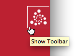

.. _project_narr:

Creating a :app:`Pyramid` Project
=================================

As we saw in :ref:`firstapp_chapter`, it's possible to create a :app:`Pyramid`
application completely manually.  However, it's usually more convenient to use
our :term:`cookiecutter` to generate a basic :app:`Pyramid` :term:`project`.

A project is a directory that contains at least one Python :term:`package`.
You'll use the :app:`Pyramid` cookiecutter to create a project, and you'll
create your application logic within a package that lives inside the project.
Even if your application is extremely simple, it is useful to place code that
drives the application within a package, because (1) a package is more easily
extended with new code, and (2) an application that lives inside a package can
also be distributed more easily than one which does not live within a package.

The Pylons Project provides a :app:`Pyramid` cookiecutter that you can use to
generate a project.  Our cookiecutter allows several configuration options
to generate the type of application you're trying to construct.

This cookiecutter is rendered using the ``cookiecutter`` command that you may install.

.. seealso::

    See also `Cookiecutter Installation <https://cookiecutter.readthedocs.io/en/latest/installation.html>`_.

.. index::
   single: cookiecutters
   single: pyramid-cookiecutter-starter

.. _additional_cookiecutters:

:app:`Pyramid` cookiecutters
----------------------------

The Pyramid cookiecutter released under the Pylons Project offers the following configuration options:

- templating libraries (:term:`Jinja2`, :term:`Chameleon`, or :term:`Mako`)

- the persistence mechanism (no persistence mechanism, :term:`SQLAlchemy` with SQLite, or :term:`ZODB`)

- the mechanism of mapping URLs to code (:term:`URL dispatch` or :term:`traversal`)

* `pyramid-cookiecutter-starter <https://github.com/Pylons/pyramid-cookiecutter-starter>`_

All configuration options offer a choice of templating language.

The configuration of mapping URLs to code (routing) depends on the backend option selected, with additional variations as follows.

``none``
    :term:`URL dispatch` for routing

``sqlalchemy``
    SQLite for persistent storage, :term:`SQLAlchemy` for an ORM, :term:`URL dispatch` for routing, and :term:`Alembic` for database migrations

``zodb``
    :term:`ZODB` for persistent storage and :term:`traversal` for routing

.. index::
   single: creating a project
   single: project
   single: cookiecutter

.. _creating_a_project:

Creating the Project
--------------------

In :ref:`installing_chapter`, you created a virtual Python environment via the
``venv`` command. We called the virtual environment directory
``env`` and set an environment variable ``VENV`` to its path.

We assume that you :ref:`previously installed cookiecutter <cookiecutters>`, following its installation instructions.

When we invoke ``cookiecutter``, it will create a directory that represents our project.

We assume our current working directory is the value of ``VENV``.

On all platforms, generate a project using cookiecutter.

.. code-block:: bash

    cookiecutter gh:Pylons/pyramid-cookiecutter-starter --checkout master

If prompted for the first item, accept the default ``yes`` by hitting return.

.. code-block:: text

    You've cloned ~/.cookiecutters/pyramid-cookiecutter-starter before.
    Is it okay to delete and re-clone it? [yes]: yes
    project_name [Pyramid Scaffold]: myproject
    repo_name [myproject]: myproject
    Select template_language:
    1 - jinja2
    2 - chameleon
    3 - mako
    Choose from 1, 2, 3 [1]: 1
    Select backend:
    1 - none
    2 - sqlalchemy
    3 - zodb
    Choose from 1, 2, 3 [1]: 1

We then run through the following commands.

On Unix:

.. code-block:: bash

    # Reset our environment variable for a new virtual environment.
    export VENV=~/env/myproject/env
    # Change directory into your newly created project.
    cd myproject
    # Create a new virtual environment...
    python3 -m venv $VENV
    # ...where we upgrade packaging tools.
    $VENV/bin/pip install --upgrade pip setuptools

Or on Windows:

.. code-block:: doscon

    # Reset our environment variable for a new virtual environment.
    set VENV=c:\env\myproject\env
    # Change directory into your newly created project.
    cd myproject
    # Create a new virtual environment...
    python -m venv %VENV%
    # ...where we upgrade packaging tools.
    %VENV%\Scripts\pip install --upgrade pip setuptools

As a result of invoking the ``cookiecutter`` command, a directory named
``myproject`` is created.  That directory is a :term:`project` directory. The
``setup.py`` file in that directory can be used to distribute your application,
or install your application for deployment or development.

An ``.ini`` file named ``development.ini`` will be created in the project
directory.  You will use this ``.ini`` file to configure a server, to run your
application, and to debug your application.
It contains configuration that enables an interactive debugger and :term:`settings` optimized for development.

Another ``.ini`` file named ``production.ini`` will also be created in the
project directory.  It contains configuration that disables any interactive
debugger (to prevent inappropriate access and disclosure), and turns off a
number of debugging settings.  You can use this file to put your application
into production.

The ``myproject`` project directory contains an additional subdirectory named
``myproject`` representing a Python :term:`package`
which holds very simple :app:`Pyramid` sample code.  This is where you'll edit
your application's Python code and templates.

We created this project in a directory next to its virtual environment directory.
However, note that this is not mandatory. The project directory can go more or
less anywhere on your filesystem. You don't need to put it in a special "web
server" directory. You could put it within a virtual environment
directory. The author uses Linux mainly, and tends to put project directories
which he creates within his ``~/projects`` directory. On Windows, it's a good
idea to put project directories within a directory that contains no space
characters, so it's wise to *avoid* a path that contains, i.e., ``My
Documents``. As a result, the author, when he uses Windows, just puts his
projects in ``C:\projects``.

.. warning::

   You'll need to avoid using ``cookiecutter`` to create a project with the same
   name as a Python standard library component. In particular, this means you
   should avoid using the names ``site`` or ``test``, both of which conflict
   with Python standard library packages.  You should also avoid using the name
   ``pyramid``, which will conflict with Pyramid itself.

.. index::
   single: setup.py develop
   single: development install

Installing your Newly Created Project for Development
-----------------------------------------------------

To install a newly created project for development, you should ``cd`` to the
newly created project directory and use the Python interpreter from the
:term:`virtual environment` you created during :ref:`installing_chapter` to
invoke the command ``pip install -e .``, which installs the project in
development mode (``-e`` is for "editable") into the current directory (``.``).

The file named ``setup.py`` will be in the root of the cookiecutter-generated
project directory.  The ``python`` you're invoking should be the one that lives
in the ``bin`` (or ``Scripts`` on Windows) directory of your virtual Python
environment.  Your terminal's current working directory *must* be the newly
created project directory.

On Unix:

.. code-block:: bash

    $VENV/bin/pip install -e .

Or on Windows:

.. code-block:: doscon

    %VENV%\Scripts\pip install -e .

Elided output from a run of this command on Unix is shown below:

.. code-block:: bash

    Running setup.py develop for myproject
    Successfully installed Jinja2-2.11.2 Mako-1.1.3 MarkupSafe-1.1.1 PasteDeploy-2.1.1 Pygments-2.7.3 hupper-1.10.2 myproject plaster-1.0 plaster-pastedeploy-0.7 pyramid-1.10.5 pyramid-debugtoolbar-4.9 pyramid-jinja2-2.8 pyramid-mako-1.1.0 repoze.lru-0.7 translationstring-1.4 venusian-3.0.0 waitress-1.4.4 webob-1.8.6 zope.deprecation-4.4.0 zope.interface-5.2.0

This will install a :term:`distribution` representing your project into the
virtual environment interpreter's library set so it can be found by ``import``
statements and by other console scripts such as ``pserve``, ``pshell``,
``proutes``, and ``pviews``.

.. index::
   single: running tests
   single: tests (running)

Running the Tests for Your Application
--------------------------------------

To run unit tests for your application, you must first install the testing
dependencies.

On Unix:

.. code-block:: bash

    $VENV/bin/pip install -e ".[testing]"

On Windows:

.. code-block:: doscon

    %VENV%\Scripts\pip install -e ".[testing]"

Once the testing requirements are installed, then you can run the tests using
the ``pytest`` command that was just installed in the ``bin`` directory of
your virtual environment.

On Unix:

.. code-block:: bash

    $VENV/bin/pytest -q

On Windows:

.. code-block:: doscon

    %VENV%\Scripts\pytest -q

Here's sample output from a test run on Unix:

.. code-block:: bash

    $VENV/bin/pytest -q
    ....
    4 passed in 0.31s

The tests themselves are found in the ``tests`` package in your ``cookiecutter``-generated project.
Within this project generated by the ``pyramid-cookiecutter-starter`` cookiecutter, only a few sample tests exist.

.. note::

    The ``-q`` option is passed to the ``pytest`` command to limit the output
    to a stream of dots. If you don't pass ``-q``, you'll see verbose test
    result output (which normally isn't very useful).

Alternatively, if you'd like to see test coverage, pass the ``--cov`` option
to ``pytest``:

.. code-block:: bash

    $VENV/bin/pytest --cov -q

Cookiecutters include configuration defaults for ``pytest`` and test coverage.
These configuration files are ``pytest.ini`` and ``.coveragerc``, located at
the root of your package. Without these defaults, we would need to specify the
path to the module on which we want to run tests and coverage.

.. code-block:: bash

    $VENV/bin/pytest --cov=myproject myproject tests -q

.. seealso:: See ``pytest``'s documentation for :ref:`pytest:usage` or invoke
   ``pytest -h`` to see its full set of options.

.. index::
   single: running an application
   single: pserve
   single: reload
   single: starting

.. _running_the_project_application:

Running the Project Application
-------------------------------

.. seealso:: See also the output of :ref:`pserve --help <pserve_script>`.

Once a project is installed for development, you can run the application it
represents using the ``pserve`` command against the generated configuration
file.  In our case, this file is named ``development.ini``.

On Unix:

.. code-block:: bash

    $VENV/bin/pserve development.ini

On Windows:

.. code-block:: doscon

    %VENV%\Scripts\pserve development.ini

Here's sample output from a run of ``pserve`` on Unix:

.. code-block:: bash

    $VENV/bin/pserve development.ini
    Starting server in PID 77171.
    Serving on http://localhost:6543
    Serving on http://localhost:6543

Access is restricted such that only a browser running on the same machine as
Pyramid will be able to access your Pyramid application.  However, if you want
to open access to other machines on the same network, then edit the
``development.ini`` file, and replace the ``listen`` value in the
``[server:main]`` section, changing it from ``localhost:6543`` to ``*:6543``
(this is equivalent to ``0.0.0.0:6543 [::]:6543``).  For example:

.. code-block:: ini

    [server:main]
    use = egg:waitress#main
    listen = *:6543

Now when you use ``pserve`` to start the application, it will respond to
requests on *all* IP addresses possessed by your system, not just requests to
``localhost``.  This is what the ``0.0.0.0`` in
``serving on http://0.0.0.0:6543`` means.  The server will respond to requests
made to ``127.0.0.1`` and on any external IP address. For example, your system
might be configured to have an external IP address ``192.168.1.50``.  If that's
the case, if you use a browser running on the same system as Pyramid, it will
be able to access the application via ``http://127.0.0.1:6543/`` as well as via
``http://192.168.1.50:6543/``. However, *other people* on other computers on
the same network will also be able to visit your Pyramid application in their
browser by visiting ``http://192.168.1.50:6543/``. The same holds true if you use
IPv6. ``[::]`` means the same as ``0.0.0.0`` but for IPv6 protocol.

You can change the port on which the server runs on by changing the same
portion of the ``development.ini`` file.  For example, you can change the
``listen = localhost:6543`` line in the ``development.ini`` file's ``[server:main]``
section to ``listen = localhost:8080`` to run the server on port 8080 instead of port 6543.

You can shut down a server started this way by pressing ``Ctrl-C`` (or
``Ctrl-Break`` on Windows).

The default server used to run your Pyramid application when a project is
created from a cookiecutter is named :term:`Waitress`.  This server is what prints
the ``Serving on...`` line when you run ``pserve``.  It's a good idea to use
this server during development because it's very simple.  It can also be used
for light production.  Setting your application up under a different server is
not advised until you've done some development work under the default server,
particularly if you're not yet experienced with Python web development.  Python
web server setup can be complex, and you should get some confidence that your
application works in a default environment before trying to optimize it or make
it "more like production".  It's awfully easy to get sidetracked trying to set
up a non-default server for hours without actually starting to do any
development.  One of the nice things about Python web servers is that they're
largely interchangeable, so if your application works under the default server,
it will almost certainly work under any other server in production if you
eventually choose to use a different one.  Don't worry about it right now.

For more detailed information about the startup process, see
:ref:`startup_chapter`.  For more information about environment variables and
configuration file settings that influence startup and runtime behavior, see
:ref:`environment_chapter`.

.. _reloading_code:

Reloading Code
~~~~~~~~~~~~~~

During development, it's often useful to run ``pserve`` using its ``--reload``
option.  When ``--reload`` is passed to ``pserve``, changes to any Python
module your project uses will cause the server to restart.  This typically
makes development easier, as changes to Python code made within a
:app:`Pyramid` application is not put into effect until the server restarts.

For example, on Unix:

.. code-block:: text

    $VENV/bin/pserve development.ini --reload
    Starting monitor for PID 36224.
    Starting server in PID 36224.
    Serving on http://localhost:6543
    Serving on http://localhost:6543

Now if you make a change to any of your project's ``.py`` files or ``.ini``
files, you'll see the server restart automatically:

.. code-block:: text

    /file-path-to/myproject/development.ini changed; reloading ...
    Gracefully killing the server.
    Starting monitor for PID 36286.
    Starting server in PID 36286.
    Serving on http://localhost:6543
    Serving on http://localhost:6543

Changes to template files (such as ``.pt`` or ``.mak`` files) won't cause the
server to restart.  Changes to template files don't require a server restart as
long as the ``pyramid.reload_templates`` setting in the ``development.ini``
file is ``true``.  Changes made to template files when this setting is ``true``
will take effect immediately without a server restart.

.. index::
   single: WSGI

Viewing the Application
-----------------------

Once your application is running via ``pserve``, you may visit
``http://localhost:6543/`` in your browser.  You will see something in your
browser like what is displayed in the following image:

.. image:: project.png

This is the page shown by default when you visit an unmodified ``cookiecutter``
generated ``pyramid-cookiecutter-starter`` application in a browser.

.. index::
   single: debug toolbar

.. _debug_toolbar:

The Debug Toolbar
~~~~~~~~~~~~~~~~~

If you click on the :app:`Pyramid` logo at the top right of the page, a new
target window will open to present a debug toolbar that provides various
niceties while you're developing.  This logo will float above every HTML page
served by :app:`Pyramid` while you develop an application, and allows you to
show the toolbar as necessary.

.. image:: project-debug.png

If you don't see the Pyramid logo on the top right of the page, it means you're
browsing from a system that does not have debugging access.  By default, for
security reasons, only a browser originating from ``localhost`` (``127.0.0.1``)
can see the debug toolbar.  To allow your browser on a remote system to access
the server, add a line within the ``[app:main]`` section of the
``development.ini`` file in the form ``debugtoolbar.hosts = X.X.X.X``.  For
example, if your Pyramid application is running on a remote system, and you're
browsing from a host with the IP address ``192.168.1.1``, you'd add something
like this to enable the toolbar when your system contacts Pyramid:

.. code-block:: ini

    [app:main]
    # ... other settings ...
    debugtoolbar.hosts = 192.168.1.1

For more information about what the debug toolbar allows you to do, see the
:ref:`documentation for pyramid_debugtoolbar <toolbar:overview>`.

The debug toolbar will not be shown (and all debugging will be turned off) when
you use the ``production.ini`` file instead of the ``development.ini`` ini file
to run the application.

You can also turn the debug toolbar off by editing ``development.ini`` and
commenting out a line.  For example, instead of:

.. code-block:: ini
    :linenos:

    [app:main]
    # ... elided configuration
    pyramid.includes =
        pyramid_debugtoolbar

Put a hash mark at the beginning of the ``pyramid_debugtoolbar`` line:

.. code-block:: ini
    :linenos:

    [app:main]
    # ... elided configuration
    pyramid.includes =
    #    pyramid_debugtoolbar

Then restart the application to see that the toolbar has been turned off.

Note that if you comment out the ``pyramid_debugtoolbar`` line, the ``#``
*must* be in the first column.  If you put it anywhere else, and then attempt
to restart the application, you'll receive an error that ends something like
this:

.. code-block:: text

    ImportError: No module named #pyramid_debugtoolbar

.. index::
   single: project structure

The Project Structure
---------------------

The ``pyramid-cookiecutter-starter`` cookiecutter generated a :term:`project` (named ``myproject``),
which contains a Python :term:`package`.  The package is *also* named
``myproject``; the cookiecutter generates a project which
contains a package that shares its name.

All :app:`Pyramid` ``cookiecutter``-generated projects share a similar structure.
The ``myproject`` project we've generated has the following directory structure:

.. code-block:: text

    myproject
    ├── .coveragerc
    ├── .gitignore
    ├── CHANGES.txt
    ├── MANIFEST.in
    ├── README.txt
    ├── development.ini
    ├── myproject
    │   ├── __init__.py
    │   ├── routes.py
    │   ├── static
    │   │   ├── pyramid-16x16.png
    │   │   ├── pyramid.png
    │   │   └── theme.css
    │   ├── templates
    │   │   ├── 404.jinja2
    │   │   ├── layout.jinja2
    │   │   └── mytemplate.jinja2
    │   └── views
    │       ├── __init__.py
    │       ├── default.py
    │       └── notfound.py
    ├── production.ini
    ├── pytest.ini
    ├── setup.py
    ├── testing.ini
    └── tests
        ├── __init__.py
        ├── conftest.py
        ├── test_functional.py
        └── test_views.py

.. index::
   single: tests

``test_it.py``
~~~~~~~~~~~~~~

The ``conftest.py``, ``test_functional.py``, and ``test_views.py`` modules in the ``tests`` package includes tests for your application.

.. literalinclude:: myproject/tests/conftest.py
   :language: python
   :linenos:

.. literalinclude:: myproject/tests/test_functional.py
   :language: python
   :linenos:

.. literalinclude:: myproject/tests/test_views.py
   :language: python
   :linenos:

The sample ``conftest.py`` file contains test configuration and fixtures.
The sample ``test_functional.py`` file has two functional tests defined within it.
The sample ``test_views.py`` file has two unit tests defined within it.
These tests are executed when you run ``pytest -q``.
You may add more tests here as you build your application.
You are not required to write tests to use :app:`Pyramid`.
These files are provided only for convenience and example.

See :ref:`testing_chapter` for more information about writing :app:`Pyramid` unit tests.

The ``myproject`` :term:`Project`
---------------------------------

The ``myproject`` :term:`project` directory is the distribution and deployment
wrapper for your application.  It contains both the ``myproject``
:term:`package` representing your application as well as files used to
describe, run, and test your application.

#. ``.coveragerc`` configures coverage when running tests.

#. ``.gitignore`` tells git which files and directories to ignore from source code version control.

#. ``CHANGES.txt`` describes the changes you've made to the application.  It is
   conventionally written in :term:`reStructuredText` format.

#. ``MANIFEST.in`` is a :term:`distutils` "manifest" file, naming which files
   should be included in a source distribution of the package when ``python
   setup.py sdist`` is run.

#. ``README.txt`` describes the application in general.  It is conventionally
   written in :term:`reStructuredText` format.

#. ``development.ini`` is a :term:`PasteDeploy` configuration file that can be
   used to execute your application during development.

#. ``production.ini`` is a :term:`PasteDeploy` configuration file that can be
   used to execute your application in a production configuration.

#. ``pytest.ini`` is a configuration file for running tests.

#. ``setup.py`` is the file you'll use to test and distribute your application.
   It is a standard :term:`Setuptools` ``setup.py`` file.

#. ``testing.ini`` is a :term:`PasteDeploy` configuration file that can be used to execute your application's tests.

#. ``tests`` package which contains unit and functional test code for the application.

.. index::
   single: PasteDeploy
   single: ini file

.. _myproject_ini:

``development.ini``
~~~~~~~~~~~~~~~~~~~

The ``development.ini`` file is a :term:`PasteDeploy` configuration file. Its
purpose is to specify an application to run when you invoke ``pserve``, as well
as the deployment settings provided to that application.

The generated ``development.ini`` file looks like so:

.. literalinclude:: myproject/development.ini
   :language: ini
   :linenos:

This file contains several sections including ``[app:main]``,
``[server:main]``, and several other sections related to logging configuration.

The ``[app:main]`` section represents configuration for your :app:`Pyramid`
application.  The ``use`` setting is the only setting required to be present in
the ``[app:main]`` section.  Its default value, ``egg:myproject``, indicates
that our myproject project contains the application that should be served. 
Other settings added to this section are passed as keyword arguments to the
function named ``main`` in our package's ``__init__.py`` module.  You can
provide startup-time configuration parameters to your application by adding
more settings to this section.

.. seealso:: See :ref:`pastedeploy_entry_points` for more information about the
   meaning of the ``use = egg:myproject`` value in this section.

The ``pyramid.reload_templates`` setting in the ``[app:main]`` section is a
:app:`Pyramid`-specific setting which is passed into the framework.  If it
exists, and its value is ``true``, supported template changes will not require
an application restart to be detected.  See :ref:`reload_templates_section` for
more information.

.. warning:: The ``pyramid.reload_templates`` option should be turned off for
   production applications, as template rendering is slowed when it is turned
   on.

The ``pyramid.includes`` setting in the ``[app:main]`` section tells Pyramid to
"include" configuration from another package.  In this case, the line
``pyramid.includes = pyramid_debugtoolbar`` tells Pyramid to include
configuration from the ``pyramid_debugtoolbar`` package.  This turns on a
debugging panel in development mode which can be opened by clicking on the
:app:`Pyramid` logo on the top right of the screen.  Including the debug
toolbar will also make it possible to interactively debug exceptions when an
error occurs.

Various other settings may exist in this section having to do with debugging or
influencing runtime behavior of a :app:`Pyramid` application.  See
:ref:`environment_chapter` for more information about these settings.

The name ``main`` in ``[app:main]`` signifies that this is the default
application run by ``pserve`` when it is invoked against this configuration
file.  The name ``main`` is a convention used by PasteDeploy signifying that it
is the default application.

The ``[server:main]`` section of the configuration file configures a WSGI
server which listens on TCP port 6543.  It is configured to listen on localhost
only (``127.0.0.1``).

.. _myproject_ini_logging:

The sections after ``# logging configuration`` represent Python's standard
library :mod:`logging` module configuration for your application.
The default configuration
sends application logging output to the standard error output of your terminal.
For more information see :ref:`logging_chapter`.

See the :term:`PasteDeploy` documentation for more information about other
types of things you can put into this ``.ini`` file, such as other
applications, :term:`middleware`, and alternate :term:`WSGI` server
implementations.

.. index::
   single: production.ini

``production.ini``
~~~~~~~~~~~~~~~~~~

The ``production.ini`` file is a :term:`PasteDeploy` configuration file with a
purpose much like that of ``development.ini``.  However, it disables the debug
toolbar, and filters all log messages except those above the WARN level.  It
also turns off template development options such that templates are not
automatically reloaded when changed, and turns off all debugging options.  This
file is appropriate to use instead of ``development.ini`` when you put your
application into production.

It's important to use ``production.ini`` (and *not* ``development.ini``) to
benchmark your application and put it into production.  ``development.ini``
configures your system with a debug toolbar that helps development, but the
inclusion of this toolbar slows down page rendering times by over an order of
magnitude.  The debug toolbar is also a potential security risk if you have it
configured incorrectly.

.. index::
   single: testing.ini

``testing.ini``
~~~~~~~~~~~~~~~

The ``testing.ini`` file is a :term:`PasteDeploy` configuration file with a purpose much like that of ``development.ini``.
It is similar to ``development.ini``, but is optimized to reduce test execution time.
It disables the debug toolbar and automatic reloading of templates, as these slow down test execution.
This file is appropriate to use instead of ``development.ini`` when you run your application's tests.

.. index::
   single: MANIFEST.in

``MANIFEST.in``
~~~~~~~~~~~~~~~

The ``MANIFEST.in`` file is a :term:`distutils` configuration file which
specifies the non-Python files that should be included when a
:term:`distribution` of your Pyramid project is created when you run ``python
setup.py sdist``.  Due to the information contained in the default
``MANIFEST.in``, an sdist of your Pyramid project will include ``.txt`` files,
``.ini`` files, ``.rst`` files, graphics files, and template files, as well as
``.py`` files.
See the Python Packaging Authority's Python Packaging User Guide `Including files in source distributions with MANIFEST.in <https://packaging.python.org/guides/using-manifest-in/>`_ for more information about the syntax and usage of ``MANIFEST.in``.

Without the presence of a ``MANIFEST.in`` file or without checking your source
code into a version control repository, ``setup.py sdist`` places only *Python
source files* (files ending with a ``.py`` extension) into tarballs generated
by ``python setup.py sdist``.  This means, for example, if your project was not
checked into a Setuptools-compatible source control system, and your project
directory didn't contain a ``MANIFEST.in`` file that told the ``sdist``
machinery to include ``*.pt`` files, the ``myproject/templates/mytemplate.pt``
file would not be included in the generated tarball.

Projects generated by Pyramid cookiecutters include a default ``MANIFEST.in`` file.
The ``MANIFEST.in`` file contains declarations which tell it to include files
like ``*.pt``, ``*.css`` and ``*.js`` in the generated tarball. If you include
files with extensions other than the files named in the project's
``MANIFEST.in`` and you don't make use of a Setuptools-compatible version
control system, you'll need to edit the ``MANIFEST.in`` file and include the
statements necessary to include your new files.
In the aforementioned Python Packaging User Guide, see `MANIFEST.in commands <https://packaging.python.org/guides/using-manifest-in/#manifest-in-commands>`_ for more information about how to do this.

You can also delete ``MANIFEST.in`` from your project and rely on a :term:`Setuptools`
feature which simply causes all files checked into a version control system to
be put into the generated tarball.  To allow this to happen, check all the
files that you'd like to be distributed along with your application's Python
files into Subversion.  After you do this, when you rerun ``setup.py sdist``,
all files checked into the version control system will be included in the
tarball.  If you don't use Subversion, and instead use a different version
control system, you may need to install a :term:`Setuptools` add-on such as
``setuptools-git`` or ``setuptools-hg`` for this behavior to work properly.

.. index::
   single: setup.py

``setup.py``
~~~~~~~~~~~~

The ``setup.py`` file is a :term:`Setuptools` setup file.  It is meant to be
used to define requirements for installing dependencies for your package and
testing, as well as distributing your application.

.. note::

   ``setup.py`` is the de facto standard which Python developers use to
   distribute their reusable code.  You can read more about ``setup.py`` files
   and their usage in the `Python Packaging User Guide
   <https://packaging.python.org/>`_ and `Setuptools documentation
   <https://setuptools.readthedocs.io/en/latest/>`_.

Our generated ``setup.py`` looks like this:

.. literalinclude:: myproject/setup.py
   :language: python
   :linenos:

The ``setup.py`` file calls the :term:`Setuptools` ``setup`` function, which does
various things depending on the arguments passed to ``pip`` on the command
line.

Within the arguments to this function call, information about your application
is kept.  While it's beyond the scope of this documentation to explain
everything about :term:`Setuptools` setup files, we'll provide a whirlwind tour of what
exists in this file in this section.

Your application's name can be any string; it is specified in the ``name``
field.  The version number is specified in the ``version`` value.  A short
description is provided in the ``description`` field.  The ``long_description``
is conventionally the content of the ``README`` and ``CHANGES`` files appended
together. The ``classifiers`` field is a list of `Trove classifiers
<https://pypi.org/pypi?%3Aaction=list_classifiers>`_ describing your
application.  ``author`` and ``author_email`` are text fields which probably
don't need any description. ``url`` is a field that should point at your
application project's URL (if any).
``keywords`` are keywords that describe your project.
``packages=find_packages(exclude=['tests'])`` causes all
packages within the project to be found when packaging the application.
``include_package_data`` will include non-Python files when the application is
packaged if those files are checked into version control. ``zip_safe=False``
indicates that this package is not safe to use as a zipped egg; instead it will
always unpack as a directory, which is more convenient.
``extras_require`` is a Python dictionary that defines what is required to be installed for running tests.
``install_requires`` indicates that this package depends on the ``pyramid`` package.
We examined ``entry_points`` in our discussion of
the ``development.ini`` file; this file defines the ``main`` entry point that
represents our project's application.

Usually you only need to think about the contents of the ``setup.py`` file when
distributing your application to other people, when adding Python package
dependencies, or when versioning your application for your own use. For fun,
you can try this command now:

.. code-block:: text

    $VENV/bin/python setup.py sdist

This will create a tarball of your application in a ``dist`` subdirectory named
``myproject-0.0.tar.gz``.  You can send this tarball to other people who want
to install and use your application.

.. index::
   single: package

The ``myproject`` :term:`Package`
---------------------------------

The ``myproject`` :term:`package` lives inside the ``myproject``
:term:`project`.  It contains:

#. An ``__init__.py`` file signifies that this is a Python :term:`package`. It
   also contains code that helps users run the application, including a
   ``main`` function which is used as a entry point for commands such as
   ``pserve``, ``pshell``, ``pviews``, and others.

#. A ``templates`` directory, which contains :term:`Jinja2` (or other types
   of) templates.

#. A ``routes.py`` module, which contains routing code for the application.

#. A ``views`` package, which contains view code for the application.

#. A ``static`` directory, which contains static files, including images and CSS.

These are purely conventions established by the cookiecutter. :app:`Pyramid`
doesn't insist that you name things in any particular way. However, it's
generally a good idea to follow Pyramid standards for naming, so that other
Pyramid developers can get up to speed quickly on your code when you need help.

.. index::
   single: __init__.py

.. _init_py:

``__init__.py``
~~~~~~~~~~~~~~~

We need a small Python module that configures our application and which
advertises an entry point for use by our :term:`PasteDeploy` ``.ini`` file.
This is the file named ``__init__.py``.  The presence of an ``__init__.py``
also informs Python that the directory which contains it is a *package*.

.. literalinclude:: myproject/myproject/__init__.py
   :language: python
   :linenos:

#. Line 1 imports the :term:`Configurator` class from :mod:`pyramid.config`
   that we use later.

#. Lines 4-11 define a function named ``main`` that returns a :app:`Pyramid`
   WSGI application.  This function is meant to be called by the
   :term:`PasteDeploy` framework as a result of running ``pserve``.

   The ``main`` function configures the application.

   Line 7 opens a context manager with an instance of a :term:`Configurator`.

   Line 8 adds support for Jinja2 templating bindings, allowing us to
   specify renderers with the ``.jinja2`` extension.

   Line 9 includes the ``routes.py`` module.

   Line 10 calls ``config.scan()``, which picks up view registrations declared
   elsewhere in the package (in this case, in the ``views.py`` module).

   Line 11 returns a :term:`WSGI` application to the caller of the function
   (Pyramid's pserve).

.. seealso::
   
   See :ref:`the_startup_process` for more about the application's :ref:`settings <startup_settings>` and ``main``\'s :ref:`arguments <startup_constructor_arguments>` and statements.

.. index::
    single: routes.py

.. _routes_py:

``routes.py``
~~~~~~~~~~~~~

The ``routes.py`` module gets included by the ``main`` function in our ``__init__.py``.
It registers a view and a route.

.. literalinclude:: myproject/myproject/routes.py
    :language: python
    :linenos:

Line 2 registers a static view, which will serve up the files from the ``myproject:static`` :term:`asset specification` (the ``static`` directory of the ``myproject`` package).

Line 3 adds a :term:`route` to the configuration.  This route is later used by a view in the ``views`` module.

.. index::
   single: views.py

``views`` package
~~~~~~~~~~~~~~~~~

Much of the heavy lifting in a :app:`Pyramid` application is done by *view
callables*.  A :term:`view callable` is the main tool of a :app:`Pyramid` web
application developer; it is a bit of code which accepts a :term:`request` and
which returns a :term:`response`.

Our project has a ``views`` package by virtue of it being a directory containing an ``__init__.py`` file.
This ``__init__.py`` file happens to have no content, although it could as a project develops.

We have two view modules in the ``views`` package.
Let's look at ``default.py``.

.. literalinclude:: myproject/myproject/views/default.py
   :language: python
   :linenos:

Lines 4-6 define and register a :term:`view callable` named ``my_view``.  The
function named ``my_view`` is decorated with a ``view_config`` decorator (which
is processed by the ``config.scan()`` line in our ``__init__.py``). The
view_config decorator asserts that this view be found when a :term:`route`
named ``home`` is matched.  In our case, because our ``routes.py`` maps the
route named ``home`` to the URL pattern ``/``, this route will match when a
visitor visits the root URL.  The view_config decorator also names a
``renderer``, which in this case is a template that will be used to render the
result of the view callable.  This particular view declaration points at
``myproject:templates/mytemplate.jinja2``, which is an :term:`asset specification` that
specifies the ``mytemplate.jinja2`` file within the ``templates`` directory of the
``myproject`` package.
There is a second form of asset specification: a relative asset specification.
Instead of using an "absolute" asset specification which includes the package name, in certain circumstances you can omit the package name from the specification.
For example, you might be able to use ``../templates/mytemplate.jinja2``.
The template file pointed to is a :term:`Jinja2` template
file (``templates/mytemplate.jinja2``).

This view callable function is handed a single piece of information: the
:term:`request`.  The *request* is an instance of the :term:`WebOb` ``Request``
class representing the browser's request to our server.

This view is configured to invoke a :term:`renderer` on a template.  The
dictionary the view returns (on line 6) provides the value the renderer
substitutes into the template when generating HTML.  The renderer then returns
the HTML in a :term:`response`.

.. note:: Dictionaries provide values to :term:`template`\s.

Now let's look at ``notfound.py``.

.. literalinclude:: myproject/myproject/views/notfound.py
   :language: python
   :linenos:

This file is similar to ``default.py``.
It merely returns a ``404`` response status and an empty dictionary to the template at ``myproject:templates/404.jinja2``.

.. note:: When the application is run with the cookiecutter's :ref:`default
   development.ini <myproject_ini>` configuration, :ref:`logging is set up
   <myproject_ini_logging>` to aid debugging.  If an exception is raised,
   uncaught tracebacks are displayed after the startup messages on :ref:`the
   console running the server <running_the_project_application>`. Also
   ``print()`` statements may be inserted into the application for debugging to
   send output to this console.

.. note:: ``development.ini`` has a setting that controls how templates are
   reloaded, ``pyramid.reload_templates``.

   - When set to ``True`` (as in the cookiecutter ``development.ini``), changed
     templates automatically reload without a server restart.  This is
     convenient while developing, but slows template rendering speed.

   - When set to ``False`` (the default value), changing templates requires a
     server restart to reload them.  Production applications should use
     ``pyramid.reload_templates = False``.

.. seealso::

    See also :ref:`views_which_use_a_renderer` for more information about how
    views, renderers, and templates relate and cooperate.

.. seealso::

    Pyramid can also dynamically reload changed Python files.  See also
    :ref:`reloading_code`.

.. seealso::

    See also the :ref:`debug_toolbar`, which provides interactive access to
    your application's internals and, should an exception occur, allows
    interactive access to traceback execution stack frames from the Python
    interpreter.

.. index::
   single: static directory

``static``
~~~~~~~~~~

This directory contains static assets which support the ``layout.jinja2``
template.  It includes CSS and images.

``templates/layout.jinja2``
~~~~~~~~~~~~~~~~~~~~~~~~~~~

This is the base layout content. It contains a single marker for content block. Other templates inherit its content, providing layout for the web application. Its contents are too long to show here, but here is an excerpt:

.. literalinclude:: myproject/myproject/templates/layout.jinja2
   :language: jinja
   :lines: 34-38
   :lineno-match:

``templates/mytemplate.jinja2``
~~~~~~~~~~~~~~~~~~~~~~~~~~~~~~~

This is the content :term:`Jinja2` template that exists in the project.  It is referenced by the call to ``@view_config`` as the ``renderer``
of the ``my_view`` view callable in the ``views/default.py`` file.  See
:ref:`views_which_use_a_renderer` for more information about renderers. It inherits ("extends") the HTML provided by ``layout.jinja2``, replacing the content block with its own content.

.. literalinclude:: myproject/myproject/templates/mytemplate.jinja2
   :language: jinja
   :linenos:

Templates are accessed and used by view configurations and sometimes by view
functions themselves.  See :ref:`templates_used_directly` and
:ref:`templates_used_as_renderers`.

``templates/404.jinja2``
~~~~~~~~~~~~~~~~~~~~~~~~

This template is similar to ``mytemplate.jinja2``, but with a few differences.
It is referenced by the call to ``@notfound_view_config`` as the ``renderer`` of the ``notfound_view`` view callable in the ``views/notfound.py`` file.
It inherits the HTML provided by ``layout.jinja2``, replacing the content block with its own content.

.. literalinclude:: myproject/myproject/templates/404.jinja2
   :language: jinja
   :linenos:

.. index::
   pair: modifying; package structure

.. _modifying_package_structure:

Modifying Package Structure
---------------------------

It is best practice for your application's code layout to not stray too much
from accepted Pyramid cookiecutter defaults.  If you refrain from changing things
very much, other Pyramid coders will be able to more quickly understand your
application.  However, the code layout choices made for you by a cookiecutter are
in no way magical or required.  Despite the choices made for you by any
cookiecutter, you can decide to lay your code out any way you see fit.

For example, the configuration method named
:meth:`~pyramid.config.Configurator.add_view` requires you to pass a
:term:`dotted Python name` or a direct object reference as the class or
function to be used as a view.
By default, the ``starter`` cookiecutter would have you create a ``views`` directory, and add a single file for each view or collection of related views.
However, you might be more comfortable creating a single ``views.py`` module in your package and add view functions to it.

Whatever structure you prefer, as long as you use the ``@view_config`` directive
to register views in conjunction with ``config.scan()``, they will be picked up
automatically when the application is restarted.

Using the Interactive Shell
---------------------------

It is possible to use the ``pshell`` command to load a Python interpreter
prompt with a similar configuration as would be loaded if you were running your
Pyramid application via ``pserve``.  This can be a useful debugging tool. See
:ref:`interactive_shell` for more details.

.. _what_is_this_pserve_thing:

What Is This ``pserve`` Thing
-----------------------------

The code generated by a :app:`Pyramid` cookiecutter assumes that you will be using
the ``pserve`` command to start your application while you do development.
``pserve`` is a command that reads a :term:`PasteDeploy` ``.ini`` file (e.g.,
``development.ini``), and configures a server to serve a :app:`Pyramid`
application based on the data in the file.

``pserve`` is by no means the only way to start up and serve a :app:`Pyramid`
application.  As we saw in :ref:`firstapp_chapter`, ``pserve`` needn't be
invoked at all to run a :app:`Pyramid` application.  The use of ``pserve`` to
run a :app:`Pyramid` application is purely conventional based on the output of
its cookiecutter.  But we strongly recommend using ``pserve`` while developing
your application because many other convenience introspection commands (such as
``pviews``, ``prequest``, ``proutes``, and others) are also implemented in
terms of configuration availability of this ``.ini`` file format.  It also
configures Pyramid logging and provides the ``--reload`` switch for convenient
restarting of the server when code changes.

.. _alternate_wsgi_server:

Using an Alternate WSGI Server
------------------------------

Pyramid cookiecutters generate projects which use the :term:`Waitress` WSGI server.
Waitress is a server that is suited for development and light production
usage.  It's not the fastest nor the most featureful WSGI server. Instead, its
main feature is that it works on all platforms that Pyramid needs to run on,
making it a good choice as a default server from the perspective of Pyramid's
developers.

Any WSGI server is capable of running a :app:`Pyramid` application.  But we
suggest you stick with the default server for development, and that you wait to
investigate other server options until you're ready to deploy your application
to production.  Unless for some reason you need to develop on a non-local
system, investigating alternate server options is usually a distraction until
you're ready to deploy.  But we recommend developing using the default
configuration on a local system that you have complete control over; it will
provide the best development experience.

One popular production alternative to the default Waitress server is
:term:`mod_wsgi`. You can use ``mod_wsgi`` to serve your :app:`Pyramid` application
using the Apache web server rather than any "pure-Python" server like Waitress.
It is fast and featureful.  See :ref:`modwsgi_tutorial` for details.

Another good production alternative is :term:`gunicorn`.
It's faster than Waitress and slightly easier to configure than
``mod_wsgi``, although it depends, in its default configuration, on having a
buffering HTTP proxy in front of it.  It does not, as of this writing, work on
Windows.

Automatically Reloading Your Code
---------------------------------

During development, it can be really useful to automatically have the
webserver restart when you make changes. ``pserve`` has a ``--reload`` switch
to enable this. It uses the
`hupper <https://docs.pylonsproject.org/projects/hupper/en/latest/>`_ package
to enable this behavior. When your code crashes, ``hupper`` will wait for
another change or the ``SIGHUP`` signal before restarting again.

inotify support
~~~~~~~~~~~~~~~

By default ``hupper`` will poll the filesystem for changes to all Python
code. This can be pretty inefficient in larger projects.
To be nicer to your hard drive, you should install either the `watchman <https://facebook.github.io/watchman/>`_ or `watchdog <https://pythonhosted.org/watchdog/>`_ package in development.
``hupper`` will use, in order of preference for efficiency, if available, ``watchman``, ``watchdog``, or finally polling to detect changes to the filesystem.

Monitoring Custom Files
~~~~~~~~~~~~~~~~~~~~~~~

By default, ``pserve --reload`` will monitor all imported Python code
(everything in ``sys.modules``) as well as the config file passed to
``pserve`` (e.g., ``development.ini``). You can instruct ``pserve`` to watch
other files for changes as well by defining a ``[pserve]`` section in your
configuration file. For example, let's say your application loads the
``favicon.ico`` file at startup and stores it in memory to efficiently
serve it many times. When you change it, you want ``pserve`` to restart:

.. code-block:: ini

    [pserve]
    watch_files =
        myproject/static/favicon.ico

Paths may be absolute or relative to the configuration file. They may also
be an :term:`asset specification`. These paths are passed to ``hupper``, which
has some basic support for globbing. Acceptable glob patterns depend on the
version of Python being used.
