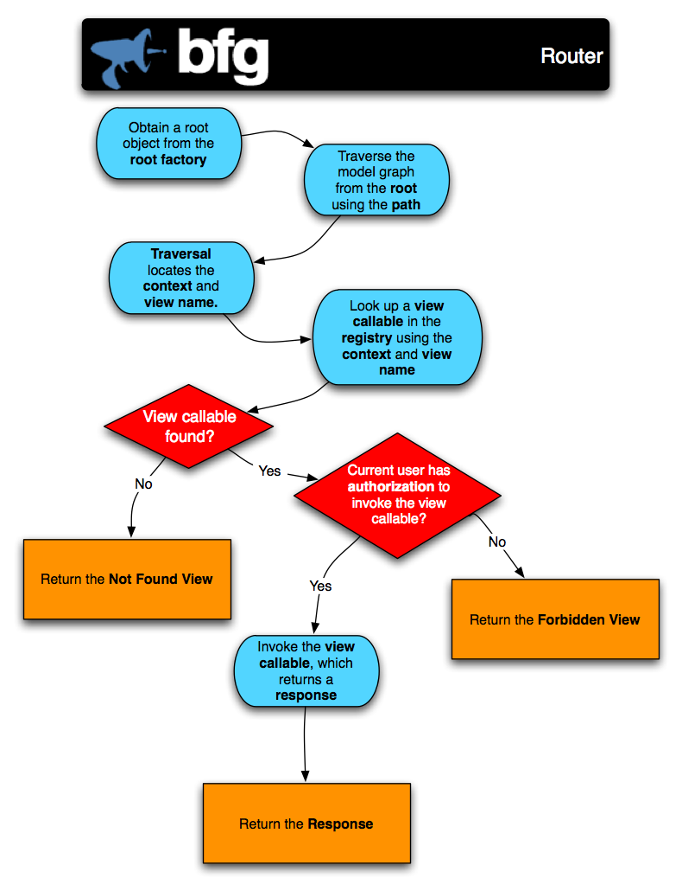

.. _router_chapter:

How :mod:`repoze.bfg` Processes A Request
=========================================

Once a :mod:`repoze.bfg` application is up and running, it is ready to
accept requests and return responses.

What happens from the time a :term:`WSGI` request enters a
:mod:`repoze.bfg` application through to the point that
:mod:`repoze.bfg` hands off a response back to WSGI for upstream
processing?

#. A user initiates a request from his browser to the hostname and
   port number of the WSGI server used by the :mod:`repoze.bfg`
   application.

#. The WSGI server used by the :mod:`repoze.bfg` application passes
   the WSGI environment to the ``__call__`` method of the
   :mod:`repoze.bfg` :term:`router` object.

#. A :term:`request` object is created based on the WSGI environment.

#. To service :term:`url dispatch`, the :mod:`repoze.bfg`
   :term:`router` calls a :term:`URL dispatch` "root factory wrapper"
   callable, which acts as a :term:`root factory`.  The job of the
   mapper is to examine the ``PATH_INFO`` implied by the request to
   determine whether any user-defined :term:`route` matches the
   current WSGI environment.  The :term:`router` passes the request as
   an argument to the mapper.

#. If any route matches, the WSGI environment is mutated; a
   ``bfg.routes.route`` key and a ``bfg.routes.matchdict`` are added
   to the WSGI environment, and an attribute named ``matchdict`` is
   added to the request.  If a route *doesn't* match, neither of these
   keys is added to the WSGI environment and the request object is not
   mutated.

#. Regardless of whether any route matched or not, the :term:`URL
   dispatch` mapper returns a root object.  If a particular
   :term:`route` named a ``factory`` argument, this factory is used to
   generate the root object, otherwise a default :term:`root factory`
   is used.  If a root factory argument was passed to the
   :term:`Configurator` constructor, that callable is used to generate
   the root object.  If the root factory argument passed to the
   Configurator constructor is ``None``, a default root factory is
   used to generate a root.

#. A ``NewRequest`` :term:`event` is sent to any subscribers.

#. The :mod:`repoze.bfg` router calls a "traverser" function with the
   root object and the request.  The traverser function attempts to
   traverse the root object (using any existing ``__getitem__`` on the
   root object and subobjects) to find a :term:`context`.  If the root
   object has no ``__getitem__`` method, the root itself is assumed to
   be the context.  The exact traversal algorithm is described in
   :ref:`traversal_chapter`. The traverser function returns a
   dictionary, which contains a :term:`context` and a :term:`view
   name` as well as other ancillary information.

#. The request is decorated with various names returned from the
   traverser (such as ``context``, ``view_name``, and so forth), so
   they can be accessed via e.g. ``request.context`` within
   :term:`view` code.

#. If an :term:`authorization policy` is in use, :mod:`repoze.bfg`
   passes the context, the request, and the view_name to a function
   which determines whether the view being asked for can be executed
   by the requesting user, based on credential information in the
   request and security information attached to the context.  If it
   returns True, :mod:`repoze.bfg` allows processing to continue.  If
   it returns False, it uses a "forbidden" view callable to generate a
   response, and returns that response.

#. If view execution is determined to be allowed, :mod:`repoze.bfg`
   looks up a :term:`view` callable using the context, the request,
   and the view name.  If a view callable doesn't exist for this
   combination of objects (based on the type of the context, the type
   of the request, and the value of the view name), :mod:`repoze.bfg`
   uses a "not found" view callable to generate a response, and
   returns that response.

#. If a view callable was found, :mod:`repoze.bfg` calls the view
   function.  The view function's response is a :term:`response`
   object.

#. A :class:`repoze.bfg.interfaces.INewResponse` :term:`event` is sent
   to any subscribers.

#. The response object's ``app_iter``, ``status``, and ``headerlist``
   attributes are used to generate a WSGI response.  The response is
   sent back to the upstream WSGI server.

This is a very high-level overview that leaves out various details.
For more detail about subsystems invoked by the BFG router (like
traversal, URL dispatch, views, and events), see
:ref:`url_mapping_chapter`, :ref:`traversal_chapter`,
:ref:`urldispatch_chapter`, :ref:`views_chapter`, and
:ref:`events_chapter`.
