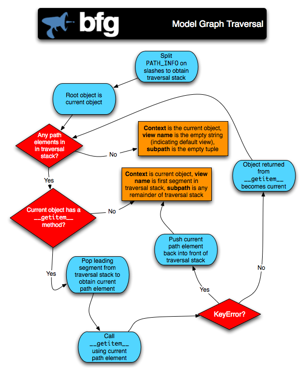

.. _traversal_chapter:

Traversal
=========

:term:`Traversal` is a :term:`context finding` mechanism. It is the
act of finding a :term:`context` and a :term:`view name` by walking
over an *object graph*, starting from a :term:`root` object, using a
:term:`request` object as a source of path information.

In this chapter, we'll provide a high-level overview of traversal,
we'll explain the concept of an *object graph*, and we'll show how
traversal might be used within an application.

.. index::
   single: traversal analogy

A Traversal Analogy
-------------------

We use an analogy to provide an introduction to :term:`traversal`.
Imagine an inexperienced UNIX computer user, wishing only to use the
command line to find a file and to invoke the ``cat`` command against
that file.  Because he is inexperienced, the only commands he knows
how to use are ``cd``, which changes the current directory and
``cat``, which prints the contents of a file.  And because he is
inexperienced, he doesn't understand that ``cat`` can take an absolute
path specification as an argument, so he doesn't know that you can
issue a single command command ``cat /an/absolute/path`` to get the
desired result.  Instead, this user believes he must issue the ``cd``
command, starting from the root, for each intermediate path segment,
*even the path segment that represents the file itself*.  Once he gets
an error (because you cannot successfully ``cd`` into a file), he
knows he has reached the file he wants, and he will be able to execute
``cat`` against the resulting path segment.

This inexperienced user's attempt to execute ``cat`` against the file
named ``/fiz/buz/myfile`` might be to issue the following set of UNIX
commands:

.. code-block::  text

   cd /
   cd fiz
   cd buz
   cd myfile

The user now knows he has found a *file*, because the ``cd`` command
issues an error when he executed ``cd myfile``.  Now he knows that he
can run the ``cat`` command:

.. code-block::  text

   cat myfile

The contents of ``myfile`` are now printed on the user's behalf.

:mod:`repoze.bfg` is very much like this inexperienced UNIX user as it
uses :term:`traversal` against an object graph.  In this analogy, we
can map the ``cat`` program to the :mod:`repoze.bfg` concept of a
:term:`view callable`: it is a program that can be run against some
:term:`context` as the result of :term:`view lookup`.  The file being
operated on in this analogy is the :term:`context` object; the context
is the "last node found" in a traversal.  The directory structure is
the object graph being traversed.  The act of progressively changing
directories to find the file as well as the handling of a ``cd`` error
as a stop condition is analogous to :term:`traversal`.

The analogy we've used is not *exactly* correct, because, while the
naive user already knows which command he wants to invoke before he
starts "traversing" (``cat``), :mod:`repoze.bfg` needs to obtain that
information from the path being traversed itself.  In
:term:`traversal`, the "command" meant to be invoked is a :term:`view
callable`.  A view callable is derived via :term:`view lookup` from
the combination of the :term:`view name` and the :term:`context`.
Traversal is the act of obtaining these two items.

.. index::
   single: traversal overview

A High-Level Overview of Traversal
----------------------------------

:term:`Traversal` is dependent on information in a :term:`request`
object.  Every :term:`request` object contains URL path information in
the ``PATH_INFO`` portion of the :term:`WSGI` environment.  The
``PATH_INFO`` portion of the WSGI environment is the portion of a
request's URL following the hostname and port number, but before any
query string elements or fragment element.  For example the
``PATH_INFO`` portion of the URL
``http://example.com:8080/a/b/c?foo=1`` is ``/a/b/c``.

Traversal treats the ``PATH_INFO`` segment of a URL as a sequence of
path segments.  For example, the ``PATH_INFO`` string ``/a/b/c`` is
converted to the sequence ``['a', 'b', 'c']``.

After the path info is converted, a lookup is performed against the
object graph for each path segment.  Each lookup uses the
``__getitem__`` method of an object in the graph.

For example, if the path info sequence is ``['a', 'b', 'c']``:

- :term:`Traversal` pops the first element (``a``) from the path
  segment sequence and attempts to call the root object's
  ``__getitem__`` method using that value (``a``) as an argument;
  we'll presume it succeeds.

- When the root object's ``__getitem__`` succeeds it will return an
  object, which we'll call "A".  The :term:`context` temporarily
  becomes the "A" object.

- The next segment (``b``) is popped from the path sequence, and the
  "A" object's ``__getitem__`` is called with that value (``b``) as an
  argument; we'll presume it succeeds.

- When the "A" object's ``__getitem__`` succeeds it will return an
  object, which we'll call "B".  The :term:`context` temporarily
  becomes the "B" object.

This process continues until the path segment sequence is exhausted or
a lookup for a path element fails.  In either case, a :term:`context`
is found.

Traversal "stops" when it either reaches a leaf level model instance
in your object graph or when the path segments implied by the URL "run
out".  The object that traversal "stops on" becomes the
:term:`context`.  If at any point during traversal any node in the
graph doesn't have a ``__getitem__`` method, or if the ``__getitem__``
method of a node raises a :exc:`KeyError`, traversal ends immediately,
and that node becomes the :term:`context`.

The results of a :term:`traversal` also include a :term:`view name`.
The :term:`view name` is the *first* URL path segment in the set of
``PATH_INFO`` segments "left over" in the path segment list popped by
the traversal process *after* traversal finds a context object.

The combination of the :term:`context` object and the :term:`view
name` found via traversal is used later in the same request by a
separate :mod:`repoze.bfg` subsystem -- the :term:`view lookup`
subsystem -- to find a :term:`view callable` later within the same
request.  How :mod:`repoze.bfg` performs view lookup is explained
within the :ref:`views_chapter` chapter.

.. index::
   single: object graph
   single: traversal graph
   single: model graph

.. _the_object_graph:

The Object Graph
----------------

When your application uses :term:`traversal` to resolve URLs to code,
your application must supply an *object graph* to :mod:`repoze.bfg`.
This graph is represented by a :term:`root` object.

In order to supply a root object for an application, at system startup
time, the :mod:`repoze.bfg` :term:`Router` is configured with a
callback known as a :term:`root factory`.  The root factory is
supplied by the application developer as the ``root_factory`` argument
to the application's :term:`Configurator`.

Here's an example of a simple root factory:

.. code-block:: python
   :linenos:

   class Root(dict):
       def __init__(self, request):
           pass

Here's an example of using this root factory within startup
configuration, by passing it to an instance of a :term:`Configurator`
named ``config``:

.. code-block:: python
   :linenos:

   config = Configurator(root_factory=Root)

Using the ``root_factory`` argument to a
:class:`repoze.bfg.configuration.Configurator` constructor tells your
:mod:`repoze.bfg` application to call this root factory to generate a
root object whenever a request enters the application.  This root
factory is also known as the global root factory.

A root factory is passed a :term:`request` object and it is expected
to return an object which represents the root of the object graph.
All :term:`traversal` will begin at this root object.  Usually a root
factory for a traversal-based application will be more complicated
than the above ``Root`` object; in particular it may be associated
with a database connection or another persistence mechanism.  A root
object is often an instance of a class which has a ``__getitem__``
method.

.. warning:: In :mod:`repoze.bfg` 1.0 and prior versions, the root
   factory was passed a WSGI *environment* object (a dictionary) while
   in :mod:`repoze.bfg` 1.1+ it is passed a :term:`request` object.
   For backwards compatibility purposes, the request object passed to
   the root factory has a dictionary-like interface that emulates the
   WSGI environment, so code expecting the argument to be a dictionary
   will continue to work.

If no :term:`root factory` is passed to the :mod:`repoze.bfg`
:term:`Configurator` constructor, or the ``root_factory`` is specified
as the value ``None``, a *default* root factory is used.  The default
root factory always returns an object that has no child nodes.

.. sidebar:: Emulating the Default Root Factory

   For purposes of understanding the default root factory better,
   we'll note that you can emulate the default root factory by using
   this code as an explicit root factory in your application setup:

   .. code-block:: python
      :linenos:

      class Root(object):
          def __init__(self, request):
              pass

      config = Configurator(root_factory=Root)

   The default root factory is just a really stupid object that has no
   behavior or state.  Using :term:`traversal` against an application
   that uses the object graph supplied by the default root object is
   not very interesting, because the default root object has no
   children.  Its availability is more useful when you're developing
   an application using :term:`URL dispatch`.

Items contained within the object graph are sometimes analogous to the
concept of :term:`model` objects used by many other frameworks (and
:mod:`repoze.bfg` APIs often refers to them as "models", as well).
They are typically instances of Python classes.

The object graph consists of *container* nodes and *leaf* nodes.
There is only one difference between a *container* node and a *leaf*
node: *container* nodes possess a ``__getitem__`` method while *leaf*
nodes do not.  The ``__getitem__`` method was chosen as the signifying
difference between the two types of nodes because the presence of this
method is how Python itself typically determines whether an object is
"containerish" or not.

Each container node is presumed to be willing to return a child node
or raise a ``KeyError`` based on a name passed to its ``__getitem__``.

Leaf-level instances must not have a ``__getitem__``.  If
instances that you'd like to be leaves already happen to have a
``__getitem__`` through some historical inequity, you should subclass
these node types and cause their ``__getitem__`` methods to simply
raise a ``KeyError``.  Or just disuse them and think up another
strategy.

Usually, the traversal root is a *container* node, and as such it
contains other nodes.  However, it doesn't *need* to be a container.
Your object graph can be as shallow or as deep as you require.

In general, the object graph is traversed beginning at its root object
using a sequence of path elements described by the ``PATH_INFO`` of
the current request; if there are path segments, the root object's
``__getitem__`` is called with the next path segment, and it is
expected to return another graph object.  The resulting object's
``__getitem__`` is called with the very next path segment, and it is
expected to return another graph object.  This happens *ad infinitum*
until all path segments are exhausted.

.. index::
   single: traversal algorithm
   single: view lookup

.. _traversal_algorithm:

The Traversal Algorithm
-----------------------

This section will attempt to explain the :mod:`repoze.bfg` traversal
algorithm.  We'll provide a description of the algorithm, a diagram of
how the algorithm works, and some example traversal scenarios that
might help you understand how the algorithm operates against a
specific object graph.

We'll also talk a bit about :term:`view lookup`.  The
:ref:`views_chapter` chapter discusses :term:`view lookup` in detail,
and it is the canonical source for information about views.
Technically, :term:`view lookup` is a :mod:`repoze.bfg` subsystem that
is separated from traversal entirely.  However, we'll describe the
fundamental behavior of view lookup in the examples in the next few
sections to give you an idea of how traversal and view lookup
cooperate, because they are almost always used together.

.. index::
   single: view name
   single: context
   single: subpath
   single: root factory
   single: default view

A Description of The Traversal Algorithm
~~~~~~~~~~~~~~~~~~~~~~~~~~~~~~~~~~~~~~~~

When a user requests a page from your :mod:`traversal` -powered
application, the system uses this algorithm to find a :term:`context`
and a :term:`view name`.

#.  The request for the page is presented to the :mod:`repoze.bfg`
    :term:`router` in terms of a standard :term:`WSGI` request, which
    is represented by a WSGI environment and a WSGI ``start_response``
    callable.

#.  The router creates a :term:`request` object based on the WSGI
    environment.

#.  The :term:`root factory` is called with the :term:`request`.  It
    returns a :term:`root` object.

#.  The router uses the WSGI environment's ``PATH_INFO`` information
    to determine the path segments to traverse.  The leading slash is
    stripped off ``PATH_INFO``, and the remaining path segments are
    split on the slash character to form a traversal sequence.

    The traversal algorithm by default attempts to first URL-unquote
    and then Unicode-decode each path segment derived from
    ``PATH_INFO`` from its natural byte string (``str`` type)
    representation.  URL unquoting is performed using the Python
    standard library ``urllib.unquote`` function.  Conversion from a
    URL-decoded string into Unicode is attempted using the UTF-8
    encoding.  If any URL-unquoted path segment in ``PATH_INFO`` is
    not decodeable using the UTF-8 decoding, a :exc:`TypeError` is
    raised.  A segment will be fully URL-unquoted and UTF8-decoded
    before it is passed it to the ``__getitem__`` of any model object
    during traversal.

    Thus, a request with a ``PATH_INFO`` variable of ``/a/b/c`` maps
    to the traversal sequence ``[u'a', u'b', u'c']``.

#.  :term:`Traversal` begins at the root object returned by the root
    factory.  For the traversal sequence ``[u'a', u'b', u'c']``, the
    root object's ``__getitem__`` is called with the name ``a``.
    Traversal continues through the sequence.  In our example, if the
    root object's ``__getitem__`` called with the name ``a`` returns
    an object (aka "object ``a``"), that object's ``__getitem__`` is
    called with the name ``b``.  If object A returns an object when
    asked for ``b``, "object ``b``"'s ``__getitem__`` is then asked
    for the name ``c``, and may return "object ``c``".

#.  Traversal ends when a) the entire path is exhausted or b) when any
    graph element raises a :exc:`KeyError` from its ``__getitem__`` or
    c) when any non-final path element traversal does not have a
    ``__getitem__`` method (resulting in a :exc:`NameError`) or d)
    when any path element is prefixed with the set of characters
    ``@@`` (indicating that the characters following the ``@@`` token
    should be treated as a :term:`view name`).

#.  When traversal ends for any of the reasons in the previous step,
    the last object found during traversal is deemed to be the
    :term:`context`.  If the path has been exhausted when traversal
    ends, the :term:`view name` is deemed to be the empty string
    (``''``).  However, if the path was *not* exhausted before
    traversal terminated, the first remaining path segment is treated
    as the view name.

#.  Any subsequent path elements after the :term:`view name` is found
    are deemed the :term:`subpath`.  The subpath is always a sequence
    of path segments that come from ``PATH_INFO`` that are "left over"
    after traversal has completed.

Once :term:`context` and :term:`view name` and associated attributes
such as the :term:`subpath` are located, the job of :term:`traversal`
is finished.  It passes back the information it obtained to its
caller, the :mod:`repoze.bfg` :term:`Router`, which subsequently
invokes :term:`view lookup` with the context and view name
information.

The traversal algorithm exposes two special cases:

- You will often end up with a :term:`view name` that is the empty
  string as the result of a particular traversal.  This indicates that
  the view lookup machinery should look up the :term:`default view`.
  The default view is a view that is registered with no name or a view
  which is registered with a name that equals the empty string.

- If any path segment element begins with the special characters
  ``@@`` (think of them as goggles), the value of that segment minus
  the goggle characters is considered the :term:`view name`
  immediately and traversal stops there.  This allows you to address
  views that may have the same names as model instance names in the
  graph unambiguously.

Finally, traversal is responsible for locating a :term:`virtual root`.
A virtual root is used during "virtual hosting"; see the
:ref:`vhosting_chapter` chapter for information.  We won't speak more
about it in this chapter.

.. index::
   single: traversal examples

Traversal Algorithm Examples
~~~~~~~~~~~~~~~~~~~~~~~~~~~~~

No one can be expected to understand the traversal algorithm by
analogy and description alone, so let's examine some traversal
scenarios that use concrete URLs and object graph compositions.

Let's pretend the user asks for
``http://example.com/foo/bar/baz/biz/buz.txt``. The request's
``PATH_INFO`` in that case is ``/foo/bar/baz/biz/buz.txt``.  Let's
further pretend that when this request comes in that we're traversing
the following object graph::

  /--
     |
     |-- foo
          |
          ----bar

Here's what happens:

- :mod:`traversal` traverses the root, and attempts to find "foo",
  which it finds.

- :mod:`traversal` traverses "foo", and attempts to find "bar", which
  it finds.

- :mod:`traversal` traverses bar, and attempts to find "baz", which it
  does not find ("bar" raises a :exc:`KeyError` when asked for "baz").

The fact that it does not find "baz" at this point does not signify an
error condition.  It signifies that:

- the :term:`context` is "bar" (the context is the last item found
  during traversal).

- the :term:`view name` is ``baz``

- the :term:`subpath` is ``('biz', 'buz.txt')``

At this point, traversal has ended, and :term:`view lookup` begins.

Because it's the "context", the view lookup machinery examines "bar"
to find out what "type" it is. Let's say it finds that the context is
a ``Bar`` type (because "bar" happens to be an instance of the class
``Bar``).  Using the :term:`view name` (``baz``) and the type, view
lookup asks the :term:`application registry` this question:

- Please find me a :term:`view callable` registered using a
  :term:`view configuration` with the name "baz" that can be used for
  the class ``Bar``.

Let's say that view lookup finds no matching view type.  In this
circumstance, the :mod:`repoze.bfg` :term:`router` returns the result
of the :term:`not found view` and the request ends.

However, for this graph::

  /--
     |
     |-- foo
          |
          ----bar
               |
               ----baz
                      |
                      biz

The user asks for ``http://example.com/foo/bar/baz/biz/buz.txt``

- :mod:`traversal` traverses "foo", and attempts to find "bar", which
  it finds.

- :mod:`traversal` traverses "bar", and attempts to find "baz", which
  it finds.

- :mod:`traversal` traverses "baz", and attempts to find "biz", which
  it finds.

- :mod:`traversal` traverses "biz", and attempts to find "buz.txt"
  which it does not find.

The fact that it does not find "buz.txt" at this point does not
signify an error condition.  It signifies that:

- the :term:`context` is "biz" (the context is the last item found
  during traversal).

- the :term:`view name` is "buz.txt"

- the :term:`subpath` is an empty sequence ( ``()`` ).

At this point, traversal has ended, and :term:`view lookup` begins.

Because it's the "context", the view lookup machinery examines "biz"
to find out what "type" it is. Let's say it finds that the context is
a ``Biz`` type (because "biz" is an instance of the Python class
``Biz``).  Using the :term:`view name` (``buz.txt``) and the type,
view lookup asks the :term:`application registry` this question:

- Please find me a :term:`view callable` registered with a :term:`view
  configuration` with the name ``buz.txt`` that can be used for class
  ``Biz``.

Let's say that question is answered by the application registry; in
such a situation, the application registry returns a :term:`view
callable`.  The view callable is then called with the current
:term:`WebOb` :term:`request` as the sole argument: ``request``; it is
expected to return a response.

.. sidebar:: The Example View Callables Accept Only a Request; How Do I Access the Context?

   Most of the examples in this book assume that a view callable is
   typically passed only a :term:`request` object.  Sometimes your
   view callables need access to the :term:`context`, especially when
   you use :term:`traversal`.  You might use a supported alternate
   view callable argument list in your view callables such as the
   ``(context, request)`` calling convention described in
   :ref:`request_and_context_view_definitions`.  But you don't need to
   if you don't want to.  In view callables that accept only a
   request, the :term:`context` found by traversal is available as the
   ``context`` attribute of the request object,
   e.g. ``request.context``.  The :term:`view name` is available as
   the ``view_name`` attribute of the request object,
   e.g. ``request.view_name``.  Other :mod:`repoze.bfg` -specific
   request attributes are also available as described in
   :ref:`special_request_attributes`.

References
----------

A tutorial showing how :term:`traversal` can be used within a
:mod:`repoze.bfg` application exists in :ref:`bfg_wiki_tutorial`.

See the :ref:`views_chapter` chapter for detailed information about
:term:`view lookup`.

The :mod:`repoze.bfg.traversal` module contains API functions that
deal with traversal, such as traversal invocation from within
application code.

The :func:`repoze.bfg.url.model_url` function generates a URL when
given an object retrieved from an object graph.

