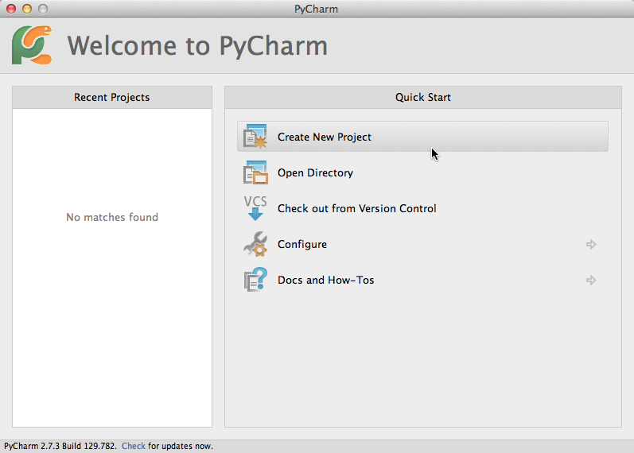
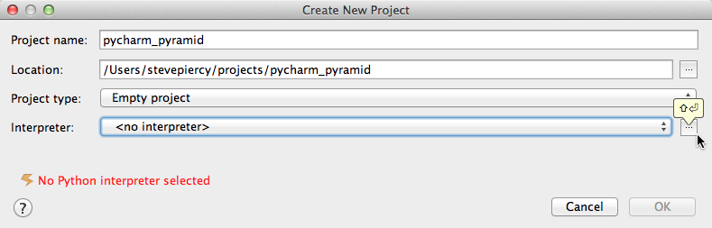
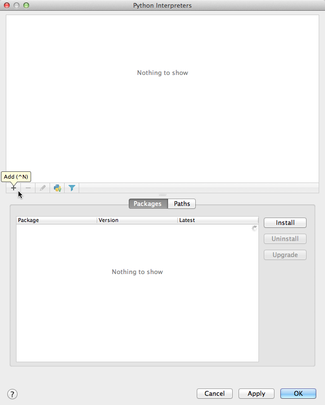
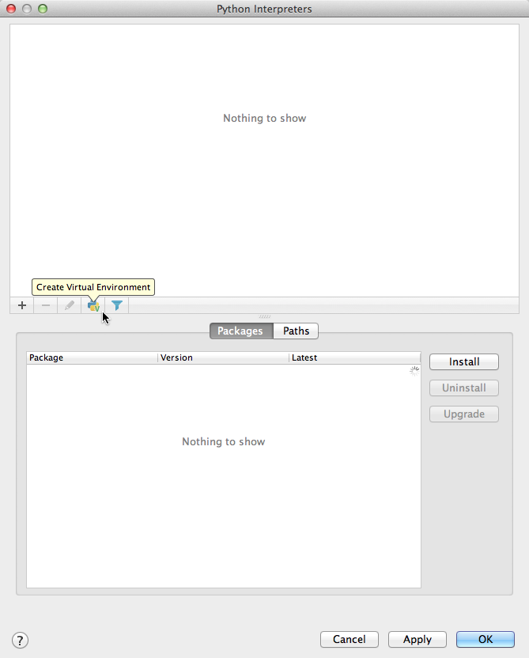
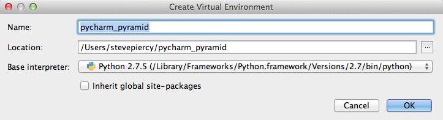
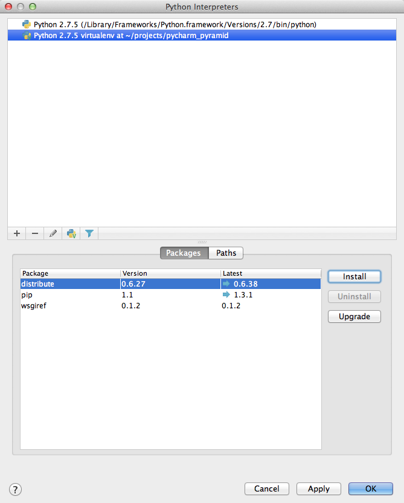
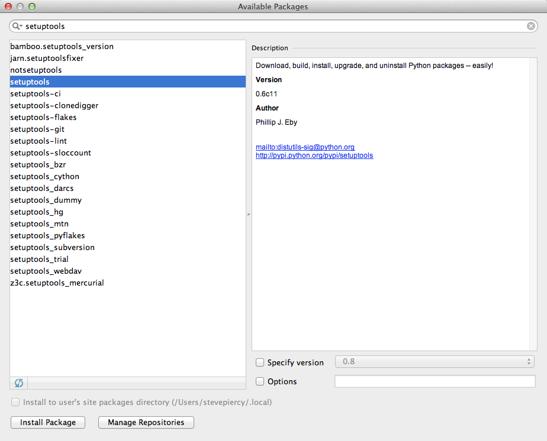
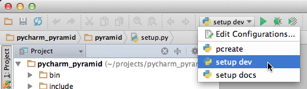

**************************
Using PyCharm with Pyramid
**************************

This tutorial is a very brief overview of how to use PyCharm with Pyramid.
`PyCharm <http://www.jetbrains.com/pycharm/>`_ is an Integrated Development
Environment (IDE) for Python programmers.  It has numerous features including
code completion, project management, version control system (git, Subversion,
etc.), debugger, and more.

This tutorial is a continual evolving document. Both PyCharm and Pyramid are
under active development, and changes to either may necessitate changes to
this document.  In addition, there may be errors or omissions in this
document, and corrections and improvements through a pull request are most
welcome.

To get started with Pyramid in PyCharm, we need to install prerequisite
software.

* Python
* PyCharm and certain Python packages
* Pyramid and its requirements

Install Python
==============

You can download installers for Mac OS X and Windows, or source tarballs for
Linux, Unix, or Mac OS X from `python.org Download
<http://python.org/download/>`_.  Follow the instructions in the README files.

Install PyCharm
===============

PyCharm is a commercial application that requires a license.  Several license
types are available depending on your usage.

Pyramid is an open source project, and on an annual basis fulfills the terms of
the Open Source License with JetBrains for the use of PyCharm to develop for
Pyramid under the Pylons Project.  If you contribute to Pyramid or the Pylons
Project, and would like to use our 1-year license, please contact the license
maintainer `stevepiercy` in the `#pyramid` channel on `irc.freenode.net`.

Alternatively you can download a 30-day trial of PyCharm or `purchase a license
<http://www.jetbrains.com/pycharm/buy/index.jsp>`_ for development or training
purposes under any other license.

`Download PyCharm <http://www.jetbrains.com/pycharm/download/index.html>`_ and
follow the installation instructions on that web page.

Configure PyCharm
=================

Create a New Project
--------------------

Launch the PyCharm application.

From the Start Up screen, click Create New Project.

If the Start Up screen does not appear, you probably have an existing project
open.  Close the existing project and the Start Up screen will appear.

In the Create New Project dialog window do the following.

* Enter a Project name.  The Location should automatically populate as you
  type.  You can change the path as you wish.  It is common practice to use the
  path `~/projects/` to contain projects.  This location shall be referred to
  as your "project directory" throughout the rest of this document.
* Project type should be Empty project.
* For Interpreter, click the ellipsis button to create a new virtual
  environment.

A new window appears, "Python Interpreters".

Create or Select a Python Interpreter
-------------------------------------

* Either click the `+` button to add a new Python interpreter for Python
  2.7 (the Python 2.7 installer uses the path
  `/Library/Frameworks/Python.framework/Versions/2.7/bin`), or use an existing
  Python interpreter for Python 2.7.  PyCharm will take a few seconds to add a
  new interpreter.

Create a Virtual Environment
----------------------------

* Click the button with the Python logo and a green "V".  A new window appears,
  "Create Virtual Environment".

* Enter a Virtual Environment name.
* The Location should automatically populate as you type.  You can change the
  path as you wish.
* The Base interpreter should be already selected, but if not, select
  `/Library/Frameworks/Python.framework/Versions/2.7/bin` or other Python 2.7
  interpreter.
* Leave the box unchecked for "Inherit global site packages".
* Click "OK".  PyCharm will set up libraries and packages, and return you to
  the Python Interpreters window.

Install setuptools and pyramid Packages
---------------------------------------

If you already have setuptools installed, you can skip this step.

In the Python Interpreters window with the just-created virtual environment
selected in the top pane, in the lower pane select the Packages tab, and click
the Install button.  The Available Packages window appears.

In the Available Packages window, in the search bar, enter "setuptools". 
Select the plain old "setuptools" package, and click the Install Package button
and wait for the status message to disappear.  PyCharm will install the package
and any dependencies.

Repeat the previous step, except use "pyramid" for searching and selecting.

.. image:: images/install_package_pyramid.png

When PyCharm finishes installing the packages, close the Available Packages
window.

In the Python Interpreters window, click the OK button.

In the Create New Project window, click the OK button.

If PyCharm displays a warning, click the Yes button.  PyCharm opens the new
project.

Clone the Pyramid repository
============================

By cloning the Pyramid repository, you can contribute changes to the code or
documentation.  We recommend that you fork the Pyramid repository to your own
GitHub account, then clone your forked repository, so that you can commit your
changes to your GitHub repository and submit pull requests to the Pyramid
project.

In PyCharm, select *VCS > Enable Version Control Integration...*, then select
Git as your VCS and click the OK button.

See `Cloning a Repository from GitHub
<http://www.jetbrains.com/pycharm/webhelp/cloning-a-repository-from-github.html
>`_ in the PyCharm documentation for more information on using GitHub and git
in PyCharm.

We will refer to the cloned repository of Pyramid on your computer as your
"local Pyramid repository".

Install development and documentation requirements
==================================================

In order to contribute bug fixes, features, and documentation changes to
Pyramid, you must install development and documentation requirements into your
virtual environment.  Pyramid uses Sphinx and reStructuredText for
documentation.

* In PyCharm, select *Run > Edit Configurations...*.  The Run/Debug
  Configurations window appears.

    .. image:: images/edit_run_debug_configurations.png

* Click the "+" button, then select Python to add a new Python run
  configuration.
* Name the configuration "setup dev".
* Either manually enter the path to the `setup.py` script or click the ellipsis
  button to navigate to the `pyramid/setup.py` path and select it.
* For Script parameters enter `dev`.
* Click the "Apply" button to save the run configuration.

While we're here, let's duplicate this run configuration for installing the
documentation requirements.

* Click the "Copy Configuration" button.  Its icon looks like two dog-eared
  pages, with a blue page on top of a grey page.
* Name the configuration "setup docs".
* Leave the path as is.
* For Script parameters enter `docs`.
* Click the "Apply" button to save the run configuration.
* Click the "OK" button to return to the project window.

In the PyCharm toolbar, you will see a Python icon and your run configurations.

First select "setup dev", and click the "run" button (the green triangle).  It
may take some time to install the requirements.  Second select "setup docs",
and click the "run" button again.

As of this writing, PyCharm does not yet have a command line interface to a
shell.  So there are some things that require you to go into a shell to enter
commands.  This next step requires doing just so.

* In your shell, navigate to your project directory, e.g., `cd
  ~/projects/pycharm_pyramid/`.
* Enter the command `source bin/activate` to activate your virtual environment.
* Navigate into your local Pyramid repository, e.g., `cd pyramid`.
* Issue the command `git submodule update --init --recursive`.
* Navigate to the `docs` directory in your local Pyramid repository with the
  command `cd docs`.
* Issue the command `make clean html` to generate the HTML documentation from
  reStructuredText files.
* The HTML files are in `_build/html`.  Open up `index.html` in a web browser
  to see the result.
* Whenever you want to edit existing docs and see the effect of your changes,
  simply run `make html` from within the `docs` directory.

Unfortunately, the author was unable to figure out how to generate docs in
PyCharm using either a "Python docs" or "Python" run configuration.  If anyone
knows, please submit a pull request.

You will now be ready to hack in and contribute to Pyramid.

Template Languages
==================

To configure the template languages Mako and Jinja, see the PyCharm
documentation `Templates
<http://www.jetbrains.com/pycharm/webhelp/templates.html>`_.

To configure the template language Chameleon, see `Creating and Registering
File Types
<http://www.jetbrains.com/pycharm/webhelp/creating-and-registering-file-types.
html>`_.  Specifically for Chameleon, we want to associate XML to the `*.pt`
extension.

* Open *PyCharm > Preferences...*, then the File Types dialog box.
* From the Recognized File Types list, select "XML files".
* In the Registered Patterns area, click the "+" button, and the Add Wildcard
  window opens.  Enter `*.pt` in the Add Wildcard window, and click the OK
  button.  Click OK again to save the settings.

Creating a Pyramid Project
==========================

The information for this section is derived from `Creating a Pyramid Project
<http://docs.pylonsproject.org/projects/pyramid/en/master/narr/project.html>`_
and adapted for use in PyCharm.

Creating a Pyramid Project Using Scaffolds
------------------------------------------

Within PyCharm, you can start a project using a scaffold by doing the
following.

* Select *Run > Edit Configurations...*.
* Click the "+" button, then select Python to add a new Python run
  configuration.
* Name the configuration "pcreate".
* Either manually enter the path to the `pcreate` script or click the ellipsis
  button to navigate to the `$VENV/bin/pcreate` path and select it.
* For Script parameters enter `-s starter MyProject`.  "starter" is the name of
  one of the scaffolds included with Pyramid, but you can use any scaffold.
  "MyProject" is the name of your project.
* Select the directory into which you want to place `MyProject`.  A common
  practice is `~/projects/`.
* Click the OK button to save the run configuration.
* Select *Run > Run 'pcreate'* to run the run configuration.  Your project will
  be created.
* Select *File > Open directory*, select the directory where you created your
  project `MyProject`, and click the Choose button.  You will be prompted to
  open the project, and you may find it convenient to select "Open in current
  window", and check "Add to currently open projects".
* Finally set the Project Interpreter to your virtual environment or verify it
  as such.  Select *PyCharm > Preferences... > Project Interpreter*, and verify
  that the project is using the same virtual environment as the parent project.
* If a yellow bar warns you to install requirements, then click link to do so.

Installing your Newly Created Project for Development
-----------------------------------------------------

We will create another run configuration, just like before.

* In PyCharm, select the `setup.py` script in the `MyProject` folder.  This
  should populate some fields with the proper values.
* Select *Run > Edit Configurations...*.
* Click the "+" button, then select Python to add a new Python run
  configuration.
* Name the configuration "MyProject setup develop".
* Either manually enter the path to the `setup.py` script in the `MyProject`
  folder or click the ellipsis button to navigate to the path and select it.
* For Script parameters enter `develop`.
* For Project, select "MyProject".
* For Working directory, enter or select the path to `MyProject`.
* Click the "Apply" button to save the run configuration.
* Finally run the run configuration "MyProject setup develop".  Your project
  will be installed.

Running The Tests For Your Application
--------------------------------------

We will create yet another run configuration.  [If you know of an easier method
while in PyCharm, please submit a pull request.]

* Select *Run > Edit Configurations...*.
* Select the previous run configuration "MyProject setup develop", and click
  the Copy Configuration button.
* Name the configuration "MyProject setup test".
* The path to the `setup.py` script in the `MyProject` folder should already be
  entered.
* For Script parameters enter `test -q`.
* For Project "MyProject" should be selected.
* For Working directory, the path to `MyProject` should be selected.
* Click the "Apply" button to save the run configuration.
* Finally run the run configuration "MyProject setup test".  Your project will
  run its unit tests.

Running The Project Application
-------------------------------

When will creation of run configurations end?  Not today!

* Select *Run > Edit Configurations...*.
* Select the previous run configuration "MyProject setup develop", and click
  the Copy Configuration button.
* Name the configuration "MyProject pserve".
* Either manually enter the path to the `pserve` script or click the ellipsis
  button to navigate to the `$VENV/bin/pserve` path and select it.
* For Script parameters enter `development.ini`.
* For Project "MyProject" should be selected.
* For Working directory, the path to `MyProject` should be selected.
* Click the "Apply" button to save the run configuration.
* Finally run the run configuration "MyProject pserve".  Your project will run.
  Click the link in the Python console or visit the URL http://0.0.0.0:6543/ in
  a web browser.

You can also reload any changes to your project's `.py` or `.ini` files
automatically by using the Script parameters `development.ini --reload`.

Debugging
=========

See the PyCharm documentation `Running and Debugging
<http://www.jetbrains.com/pycharm/webhelp/running-and-debugging.html>`_ for
details on how to debug your Pyramid app in PyCharm.

First, you cannot simultaneously run and debug your app.  Terminate your app if
it is running before you debug it.

To debug your app, open a file in your app that you want to debug and click on
the gutter (the space between line numbers and the code) to set a breakpoint. 
Then select "MyProject pserve" in the PyCharm toolbar, then click the debug
icon (which looks like a green ladybug).  Your app will run up to the first
breakpoint.
